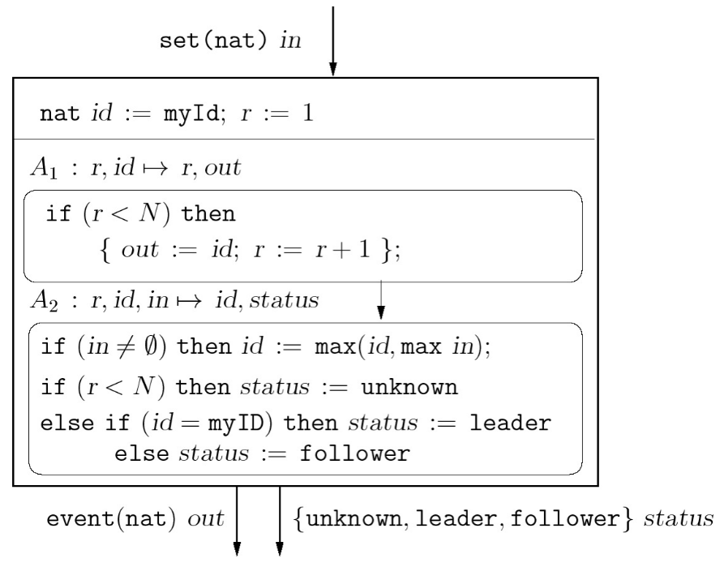
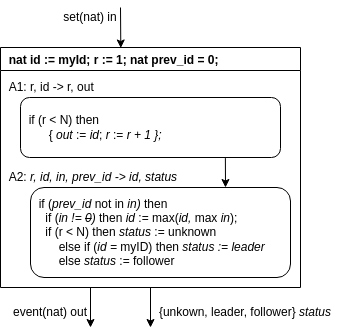
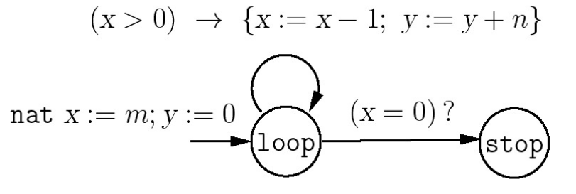
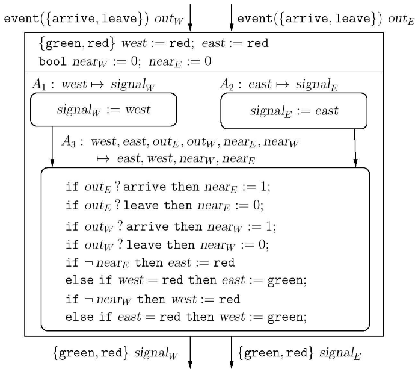
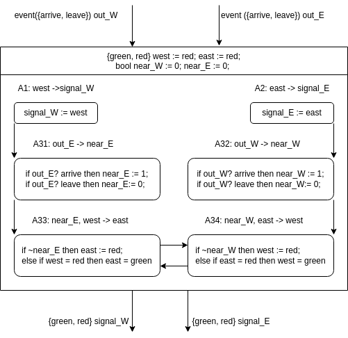
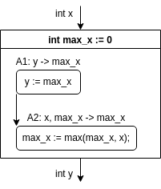

Calvin Passmore

A02107892

ECE 6790

# Homework 2

### __Exercise 2.20__:
Design a 1-bit synchronous adder *1BitAdder* by composing instances of And, Or, Not, and Xor gates.
The component *1BitAdder* has three input variables, *x*, *y*, and _carry-in_, and two output variables *z* and *carry-out*, where *z* is the least significant bit, should equal the sum of the values of the three input variables.
Then, design a 3-bit synchronous adder *3BitAdder* by composing three instances of the component *1BitAdder*. The component *3BitAdder* has input variables *x<sub>0</sub>*, *x<sub>1</sub>*, *x<sub>2</sub>*, *y<sub>0</sub>*, *y<sub>1</sub>*, *y<sub>2</sub>*, and *carry_in* and has output variables *z<sub>0</sub>*, *z<sub>1</sub>*, *z<sub>2</sub>*, and *carry_out* should equal the sum of the 3-bit number encoded by the input variables *x<sub>0</sub>*, *x<sub>1</sub>*,  *x<sub>2</sub>*, and the 3-bit number encoded by the input variables *y<sub>0</sub>*, *y<sub>1</sub>*, *y<sub>2</sub>*, and the input value of *carry_in*.
___
#### 1Bit Adder

    z = x XOR y XOR carry_in
    carry_out = (x AND y) OR (x AND carry_in) OR (y AND carry_in)

#### 3Bit Adder

    1BitAdder0 = [x->x0][y->y0][z->z0][carry_in->carry_in ][carry_out->carry_in1]
    1BitAdder1 = [x->x1][y->y1][z->z1][carry_in->carry_in1][carry_out->carry_in2]
    1BitAdder1 = [x->x2][y->y2][z->z2][carry_in->carry_in2][carry_out->carry_out]
___
___
<div style="page-break-after: always;"></div>

### __Exercise 2.22__:
Consider the leader election algorithm in synchronous networks.
Argue that if the value of *id* does not charge in a given round, then there is no need to send it in the following round (that is, the output *out* can be absent in the next round).
This can reduce the number of messages sent.
Modify the description of the component *SyncLENode* to implement this change.


___

If I the node receive the same value in two consecutive rounds, there is not point in sending the value again.
It cannot be higher than itself, so sending it again doesn't change who is going to be elected leader.

Modifications to *SyncLENode*:



___
___
<div style="page-break-after: always;"></div>

### __Exercise 3.1__:
Given two natural numbers *m* and *n*, consider the program Mult that multiplies the input numbers using two variables *x* and *y*, of type nat, as shown in the below figure.
Describe the transition system *Mult*(m,n) that captures the behavior of this program on input numbers *m* and *n*, that is, describe the states, initial states, and transitions.
Argue that when the value of the variable *x* is 0, the value of the variable *y* must equal the product of the input numbers *m* and *n*, that is, the following property is an invariant of this transition system:

```
(mode = stop) -> (y = m*n)
```

___

Initial States = {x = m; y = 0;}

States = {loop, stop}

Transitions

    if x > 0 then
        x := x + 1;
        y := y + n;
        states := loop;
    else
        states := stop

When x = 0, y must be the product of *m* and *n* because that is the definition of multiplication. Taking a number (*n*) and adding it to itself a number of times (*m*). x is set to the number of times and y is counting the running total.
___
___
<div style="page-break-after: always;"></div>

### __Exercise 3.3__:
This reaction description for the controller *Controller2* consists of three tasks as shown below.
*Split* the task A<sub>3</sub> into four tasks, each of which writes exactly on of the state variables *east*, *west*, *near<sub>W</sub>*, and *near<sub>E</sub>*.
Each task should be described by its read-set, write-set, and update code, along with the necessary precedence constraints.
The revised description should have the same set of reactions as the original description.
Does this splitting impact output/input await dependencies?
If not, what would be the potential benefits and/or drawbacks of the revised description compared to the original description?


___


___
___
<div style="page-break-after: always;"></div>

### __Exercise 3.4__:
Consider a component *C* with an output variable *x* of type *int*.
Design a safety monitor to capture the requirement that the sequence of values output by the component *C* is strictly increasing (that is, the output in each round should be strictly greater than the output in the preceding round).
___


___
___
<div style="page-break-after: always;"></div>

### __Exercise 3.6__:
Consider a transition system *T* with two integer variables *x* and *y* and a Boolean variable *z*.
All the variables are initially 0.
The transitions of the system corresponding to executing the conditional statement.

    if (z = 0) then {x := x + 1; z := 1} else {y := y + 1; z := 0}

Consider the property &Phi; given by *(x = y) || (x = y + 1)*.
Is &Phi; and invariant of the transition system *T*? Is &Phi; an inductive invariant of the transition system *T*?
Find a formula &Psi; such that &Psi; is stronger than &Phi; and is an inductive invariant of the transition system *T*.
Justify your answers.
___
&Phi; is an invariant of the system.

    x = 0; y = 0; z = 0;  <- satisfies x = y
    x = 1; y = 0; z = 1;  <- satisfies x = y + 1
    x = 1; y = 1; z = 0;  <- satisfies x = y

At this point, we are back to the starting configuration, with no change for divergence, therefore &Phi; is an invariant.

However, &Phi; is not an inductive invariant:

    x = 1; y = 0; z = 0;  <- satisfies x = y
    x = 2; y = 0; z = 1;  <- ERROR

To strengthen &Phi; add *(if x = y then z := 0 else z := 1)*, I will call this &Phi;<sub>2</sub>. &Phi;<sub>2</sub> is an invariant, but isn't inductive following the same proofs as above.
Let &Psi; = &Phi; AND &Phi;<sub>2</sub>.

&Psi; = *(x = y) || (x = y + 1)* AND *(if x = y then z := 0 else z := 1)*.

    x = 1; y = 0; z = 1;    <- satisfies x = y + 1
    x = 1; y = 1; z = 0;    <- satisfies x = y
___
___
<div style="page-break-after: always;"></div>

### __Exercise 3.7__:
Recall that the transition system *Mult*(m,n) from exercise 3.1.
First, show that the invariant property (mode = *stop*) -> (y = m * n) is not an inductive invariant.
Then find a stronger property that is an inductive invariant.
Justify your answers.
___

    m = 2; n = 4;
    x = 1; y = 0; mode = loop;
    x = 0; y = 4; mode = stop;  <- ERROR

&Psi; = *(mode = stop) -> (y = m * n)* AND *(if y = 0 then x = m and mode = loop)*

    m = 2; n = 4;
    x = 2; y = 0; mode = loop;
    x = 1; y = 4; mode = loop;
    x = 0; y = 8; mode = loop;
    x = 0; y = 8; mode = stop;
___
___
