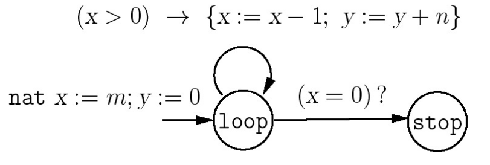
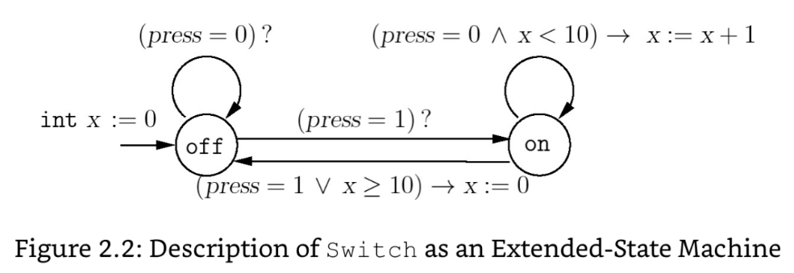
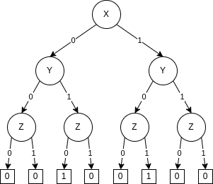
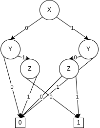
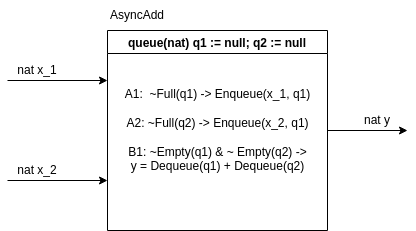

Calvin Passmore

A02107892

ECE 6790

# Homework 3

## 3.13

Consider the transition system $Mult(m,n)$ described in exercise 3.1. Describe this transition system symbolically using initialization and transition formulas.

### 3.1
Given two natural numbers *m* and *n*, consider the program Mult that multiplies the input numbers using two variables *x* and *y*, of type nat, as shown in the below figure.
Describe the transition system *Mult*(m,n) that captures the behavior of this program on input numbers *m* and *n*, that is, describe the states, initial states, and transitions.
Argue that when the value of the variable *x* is 0, the value of the variable *y* must equal the product of the input numbers *m* and *n*, that is, the following property is an invariant of this transition system:

```
(mode = stop) -> (y = m*n)
```

___

Initial States = {x = m; y = 0;}

States = {loop, stop}

Transitions

    if x > 0 then
        x := x - 1;
        y := y + n;
        states := loop;
    else
        states := stop

When x = 0, y must be the product of *m* and *n* because that is the definition of multiplication. Taking a number (*n*) and adding it to itself a number of times (*m*). x is set to the number of times and y is counting the running total.
---
Initial
$$ x = m; y = 0 $$
Transition
$$ if (x > 0) then (x' = x - 1),(y' = y + n) $$

---
---

## 3.14
Consider the description of the component *Switch* given as an extended-state machine in figure 2.2. Give the initialization and reaction formulas corresponding to *Switch*. Obtain the transition formula for the corresponding transition system in as simplified a form as possible.



---

Initial

    x := 0
    press := 0
    mode := off

Reaction

    if mode = off then
        if press = 1 then mode := on
    else # mode = on
        if x >= 10 and press = 1 then x := 1 and mode := off
        else x := x + 1
    endif

---
---

## 3.16
Consider the symbolic image computation for a transition system with two real-valued variables $x$ ad $y$ and transition description given by the formula $x' = x + 1$ or $y' = x$. Suppose the region $A$ is described by the formula $0 \le x \le 4, y \le 7$. Compute the formula describing the post-image of $A$.

---

$A'$ {$0 \le x' - 1 \le 4, 0 \le y \le 7$}
$A'$ {$1 \le x' \le 5, 0 \le y' \le 7$}

---
---

## 3.17
Consider a transition system *T* with two integer variables $x$ and $y$. The transitions of the system corresponding to executing the statement:

$$ if (x < y) then x:= x + y else y := y + 1 $$

Write the transition formula over the variables $x, y, x', and y$ that captures the transition relation of the system. Consider a region $A$ of the above transition system described by the formula $0 < x < 5$. Compute the formula describing the post-image of $A$.
---
$$ if (x < y) then x' := x + y else y' := y + 1 $$

$A$ {$ 0 < x < 5 $} where $x = 2; y = 3$
$A'$ {$ 0 < x' - y < 5$}
$A'$ {$ 0 < x' - 3 < 5$}
$A'$ {$ 3 < x' < 8$}
$A'$ {$ 3 < x < 8$}

---
---

## 3.20
Consider the Boolean formula
$$(x or y) and (~x or z) and (~y or ~z)$$

Draw the ROBDD for this formula with respect to the variable ordering $x < y < z$.

Note: The textbook has an example
---
Initial OBDD



Final ROBDD



---
---

## 4.1
We want to design an asynchronous adder process *AsyncAdd* with input channels $x_1$ and $x_2$ and an output channel $y$, all of type nat. If the *i*th input message arriving on the channel $x_1$ is $v$ and the *i*th input message arriving on channel $x_2$ is $w$, then the *i*th value output by the process *AsyncAdd* on its output channel should be $v + w$. Describe all the components of the process *AsyncAdd*
---


---
---

## 4.2
We want to design an asynchronous process *Split* that is the dual of *Merge*. The process *Split* has one input channel *in* and two output channels $out_1$ and $out_2$. The messages received on the input channel should be routed to one of the output channels in a nondeterministic manner so that all possible splittings of the input stream are feasible executions. Describe all the components of the desired process *Split*.

---


---
---


