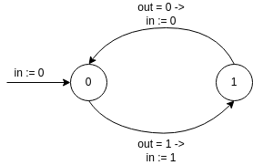
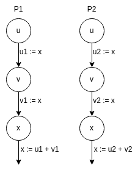
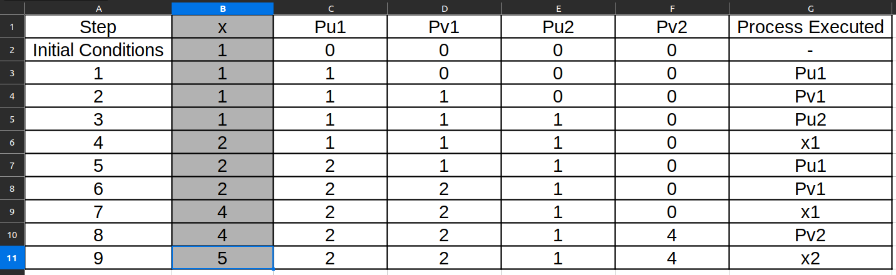
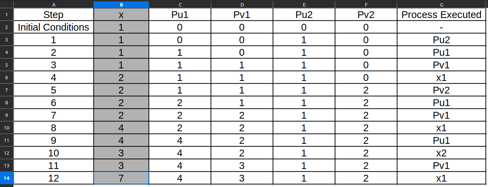
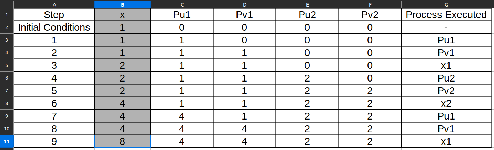
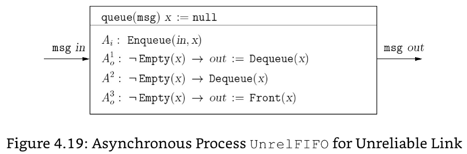

Calvin Passmore

A02107892

ECE 5790

# Homework 4

## Exercise 4.3:
Describe an asynchronous process *AsyncAnd* that models an asynchronous *And* gate with two Boolean input channels $in_1$ and $in_2$ and a Boolean output channel $out$. The process can be described as an extended-state machine with three models as in the case of the process *AsyncNot* in *figure4.5* and with three Boolean state variables.

---

---
---

# Exercise 4.4:
Consider the asynchronous process
$$ Merge[out \rightarrow temp]\ |\ Merge[in_1 \rightarrow temp][in_2 \rightarrow in_3] $$
obtained by connecting two instances of the process *Merge*. Show the "compiled" version of this composite process similar to the description in *figure 4.8*. Explain the input/output behavior of this composite process, as well as comment on whether the output preserves the input sequence received on each individual input, as well as, among three inputs.

---

//TODO

---
---

# Exercise 4.5:
Consider the process *AsyncNot* of *figure 4.5*.
In this exercise, we want to design an asynchronous process *AsyncNotEnv* that interacts with *AsyncNot*.
The process *AsyncNotEnv* has a Boolean input channel *out* and a Boolean output channel *in*.
It first outputs the value 0 and then is able to receive inputs.
It waits until the received input equals 1 and processes to output the value 1, and then waits until the received input equals 0.
This cycle is then repeated.
Model the desired asynchronous process *AsyncNotEnv* as an extended-state machine.
Consider the asynchronous compositions *AsyncNot* | *AsyncNotEnv* and argue that (*AsyncNot*.mode $\neq$ *hazard*) is an invariant of the composite process.

---

This will guraruntee that (*AsyncNot*.mode $\neq$ *hazard*) is an invariant becuase this waits until the output has changed to update the input. Whenever the output is changed, *AsyncNot* is in a stable state and we wait for it to be in a stable state again before updating the input.

---
---

# Exercise 4.8
In Peterson's mutual exclusion protocol (see *figure 4.13*), the process $P_1$, when it wants to enter the critical section, first sets the register $flag_1$ to 1 and then sets the register *turn* to 1. Suppose we switch the order in which these two steps are executed. That is, consider a modified version of Peterson's protocol in which the process $P_1$, when it wants to enter the critical section, first sets the register *turn* to 1 and then sets the register $flag_1$ to 1; symmetrically, the process $P_2$, when it wants to enter the critical section, first sets the register *turn* to 2 and then sets the register $flag_2$ to 1. Everything else stays the same. Does the modified protocol satisfy the requirement of mutual exclusion? If yes, give a brief justification; if no, show a counterexample.

---

In the switched Peterson's protocol, the processes would end up having the same mutual exclusion. This is because whenever one of those registers is being checked (flag or turn), the only time they would be different from the original execution is when a process is in *Try1*, excluding it from being in the *Critical Section*. When the process enters *Try2*, all states and variables are as they were in the previous version.

---
---

# Exercise 4.9

Consider two asynchronous processes $P_1$ and $P_2$ that communicate using a shared atomic register $x$ of type nat with initial value 1. The process $P_1$ reads the shared register and stores the value in its internal state variable $u_1$, reads it again and stores the value in another state variable $v_1$, updates the shared registered value with the sum of $u_1$ and $v_1$, and repeats this sequence of read, read, and write. The process $P_2$ is symmetric; it reads the shared register and stores the value in its interval state variable $u_2$, reads it again and stores the value in another state variable $v_2$, updates the shared register with the sum of $u_2$ and $v_2$, and repeats this sequence. Let us say that a value $n$ is reachable if there is an execution of the system in which the value of the shared register $x$ is $n$ at the end of the execution. Which values are reachable? Hint: try to find executions that demonstrate the reachability of values 5, 6, 7, and 8.

---

Execution Steps for x = 5, 6, 7, and 8

The above pictures show how one can make $x$ equal the numbers, 5-8. Making other numbers could follow the format of getting $x$ to be an odd number that when added to an even number (that is easier to make), it would equal the desired number. For example, with making 7 in the above pictures, Pu2 was used to save the value 1 (to eventually make 3), Pv2 was used to save the value 2 (to eventually make 3), Pu1 was used to make 4, then 3 was made and saved in Pv1, making 7.

---
---

# Exercise 4.10
Let us revisit the asynchronous process *Split* that you designed in *exercise 4.2*. Suppose we want to capture the assumption that the distribution of messages among the two output channels should be, while unspecified, fair in the sense that if infinitely many messages arrive on the input channel *in*, then both output channels $out_1$ and $out_2$ should have infinitely many messages transmitted. How would you add fairness assumptions to your design to capture this? If you are using strong fairness, then argue that weak fairness would not be enough (that is, describe an infinite execution that is weakly fair but the split of messages is not fair as desired).

---

If fairness would be put onto the *Split* component, it would have to be Strong, because both tasks would be repeatedly enabled. Weak would not be enough because neither is continuously enabled.

---
---

# Exercise 4.11
By modifying the description of the process *UnrelFIFO* of *figure 4.19*, construct a precise specification of the process *VeryUnrelFIFO*, which, in addition to losing and duplicating messages, can also reorder messages. What would be natural fairness assumptions for the modified process?

---

$$ A^4 : \neg Empty(x) \rightarrow Enqueue(Dequeue(x)) $$

This will remove the next item and reinsert it, thereby reordering the items in the FIFO.

The fairness would need to be as follows:

| Task  | Fairness Requirement | Reason |
|-------|----------------------|--------|
| $A_i$ | Weak | Task will be continuously enable and should be repeatedly executed
| $A_0^1$ | Strong/None | Task will be enabled and disabled depending on the speed of the Enqueue vs Dequeue. A strong fairness would indicate a reliable FIFO, since this is an unreliable FIFO, this task won't necessarily be executed every time, so there is no fairness in that case.
| $A_0^2$ | None | Not guaranteed to be executed, creating the unreliability
| $A_0^3$ | None | Not guaranteed to be executed, creating the unreliability
| $A_0^4$ | None | Not guaranteed to be executed, creating the unreliability

---
----

