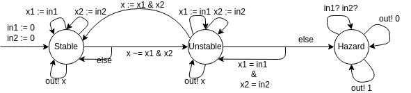

Calvin Passmore

A02107892

ECE 5790

# Homework 4

## Exercise 4.3:
Describe an asynchronous process *AsyncAnd* that models an asynchronous *And* gate with two Boolean input channels $in_1$ and $in_2$ and a Boolean output channel $out$. The process can be described as an extended-state machine with three models as in the case of the process *AsyncNot* in *figure4.5* and with three Boolean state variables.

---

---
---

# Exercise 4.4:
Consider the asynchronous process
$$ Merge[out \rightarrow temp] | Merge[in_1 \rightarrow temp][in_2 \rightarrow in_3] $$
obtained by connecting two instances of the process *Merge*. Show the "compiled" version of this composite process similar to the description in _figure_ 4.8*. Explain the input/output behavior of this composite process, as well as comment on whether the output preserves the input sequence received on each individual input, as well as, among three inputs.

---

---
---

# Exercise 4.5:
Consider the process *AsyncNot* of *figure 4.5*.
In this exercise, we want to design an asynchronous process *AsyncNotEnv* that interacts with *AsyncNot*.
The process *AsyncNotEnv* has a Boolean input channel *out* and a Boolean output channel *in*.
It first outputs the value 0 and then is able to receive inputs.
It waits until the received input equals 1 and processes to output the value 1, and then waits until the received input equals 0.
This cycle is then repeated.
Model the desired asynchronous process *AsyncNotEnv* as an extended-state machine.
Consider the asynchronous compositions *AsyncNot* | *AsyncNotEnv* and argue that (*AsyncNot*.mode $\neq$ *hazard*) is an invariant of the composite process.

---

---
---

# Exercise
