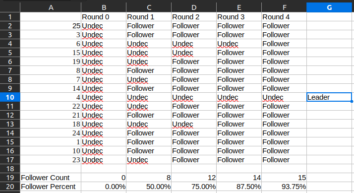

Calvin Passmore

A02107892

ECE 6790

# Exercise 4.14

For the leader election protocol of *figure 4.21*, consider a ring with 16 nodes where the identifiers of the processes in order are: 25, 3, 6, 15, 19, 8, 7, 14, 4, 22, 21, 18, 24, 1, 10, 23. Which process will be elected as the leader?

---

4 will be elected

---
---

# Exercise 4.16

Suppose we know that the communication link from 
the receiver back to the sender is reliable.
How would you modify the alternating-bit protocol to take advantage of this?
That is, design simplified versions of the processes P5 and Pr so that the composite system shown in figure 4.22 acts a reliable FIFO buffer when the  process UnrelFIF02 is replaced by the process Buffer..

---

Change task C to below and delete task B in the ABP protocol discussed in class.

$B_1$ if second(y1) $\neq$ tag then

{tag := $\neg$ tag; Enqueue(First(y1), y); y2! tag }

---
---

# Exercise 4.19

Consider the following solution to the two-process consensus problem in the asynchronous model.
The processes use a shared atomic register x and a shared test-and-set register y.
The possible values for the register x are null, 0, and 1, and the initial value is null.
The possible values for the register y are 0 and 1, and its initial value is 0. Each process executes the following sequence of steps:

  1. Write its initial preference to the register x.

  2. Execute a test-and-set operation on the register y.

  3. If step (2) returns 0, then decide on its own initial preference.

  4. If step (2) returns 1, then read the register x and decide on the 
    value read.

Consider the three requirements for consensus: validity, agreement, and wait-freedom.
Which of these requirements are satisfied by this protocol? Justify your answer.

---

validity - each process' decision must be valid - This is satisfied because the only two possible decisions are both valid

agreement - the decision's must match - The two decisions will not necessarily match, because P1 could execute steps 1 and 2 setting x to P1 and Y to 1. Then P2 could execute 1 and 2, setting x to P2 and y to 1. P1y = 0 so is decides it's own preference P1. P2y = 1 so it decides to read and decide the value in x which is P2.

wait-freedom - one process does not have to wait on the other to make a decision - The two processes don't have to wait on each other to either read or write the registers.

---
---

# Exercise 5.2

For each of the pair of formulas below, say whether the 
two are equivalent and if not whether one of them is a stronger 
requirement than the other. In each case, justify your answer.

  1. $\diamond$ ($\phi _1 \wedge \phi _2$) and ($\diamond \phi _1 \wedge \diamond \phi _2$)

  2. $\diamond$ ($\phi _1$ V $\phi _2$) and ($\diamond \phi _1$ V $\diamond \phi _2$)

  3. $\square \diamond$ ($\phi _1 \wedge \phi _2$) and ($\square \diamond \phi _1 \wedge \square \diamond \phi _2$).

  4. $\square \diamond$ ($\phi _1$ V $\phi _2$) and ($\square \diamond \phi _1$ V $\square \diamond \phi _2$).

---

  1. They are the different because in the first, both need to be true at the same time, in the second either will be true eventually but not necessarily at the same time. The first is stronger.

  2. They are the same, because in both cases only one $\phi$ needs to be eventually executed.

  3. They are different because in the first both $\phi$ need to be true at the same time, and in the second they both need to be enabled but not at the same time. The first is stronger

  4. They are the same, because in either, only one $\phi$ needs to be always eventually enabled.

---
---

# Exercise 5.3

Are the LTL-formulas $\neg$($\phi _1$ U $\phi _2$) and ($\neg \phi _1$ U $\neg \phi _2$)
equivalent?
If not, is one of them a stronger requirement than the other?
Justify your answer.

---

They are not equivalent, and the second is stronger. The first could be satisfied in a variety of ways, because it's a $\neg$ requirement. The second has to be $\neg \phi _1$ until $\neg \phi _2$, which can only be satisfied in one specific sequence.

---
---

# Exercise 5.5

Consider the design of the synchronous three-bit counter from *section 2.4.1*.
Write an LTL-formula to express the requirement that if the input signal *inc* is repeatedly high, then it is guaranteed that the counter will be repeatedly at its maximum value (that is, all the three output bits $out _0$, $out _1$, and $out _2$ are 1).
Does the circuit 3BitCounter of *figure 2.27* satisfy this specification?

---
where $\phi$ := inc
and   $\psi$ := {$out_0, out_1, out_2$} = {1,1,1}

$\square \diamond \phi \rightarrow \square \diamond \psi$

Yes the figure satisfies this specification.

---
---
