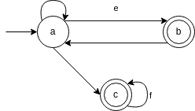
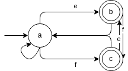
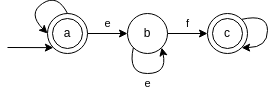
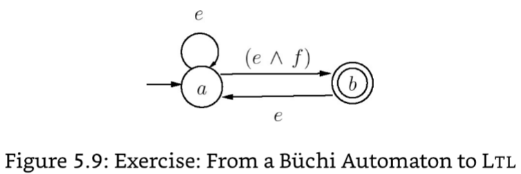
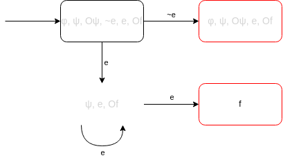

Calvin Passmore

A02107892

ECE 6790

# Homework 6

## Exercise 5.9: 
For each of the LTL formulas below, construct a Buchi
automaton that accepts exactly those traces that satisfy the formula:

1. □⋄e V ⋄□f
2. □⋄e Ʌ □⋄f
3. □(e → e U f)

---

1. 

2. 

3. 

---
---

## Exercise 5.10: 
Write an LTL formula that exactly describes the set of 
traces that are accepted by the Buchi automaton shown in figure 5.9.
Explain your answer.

---

□e Ʌ □⋄f

---
---

## Exercise 5.15

φ = (e U Of) V ~e

You are strongly encouraged to read Exercise 5.14 and its solution on the next
page first before attempting this problem. Answer the questions below instead of those in the
problem description.

(a) Show all states included in Sub(φ).

(b) Tableau construction results in 16 states. Determine whether each of the 16 states listed
below is a subset of Sub(φ). The sub-formula ψ below is ψ = (e U Of).
- q0 = {e,f,Of,Oψ,ψ,φ}
- q1 = {e,f,Of,ψ,φ}
- q2 = {e,f,Oψ,ψ,φ}
- q3 = {e,f}
- q4 = {e,Of,Oψ,ψ,φ}
- q5 = {e,Of,ψ,φ}
- q6 = {e,Oψ,ψ,φ}
- q7 = {e}
- q8 = {¬e,f,Of,Oψ,ψ,φ}
- q9 = {¬e,f,Of,ψ,φ}
- q10 = {¬e,f,Oψ,φ}
- q11 = {¬e,f,φ}
- q12 = {¬e,Of,Oψ,ψ,φ}
- q13 = {¬e,Of,ψ,φ}
- q14 = {¬e,Oψ,φ}
- q15 = {¬e,φ}

(c) You are not required to draw the entire Buchi automaton. Answer the questions below
instead.

i. List all initial states.

ii. Draw all transitions and their next states out of the initial state q0.

iii. What states does the accepting set Fψ include? List all such states.

---

(a) {φ, ψ, Oψ, ~e, e, Of}

(b)
- q0    No
- q1    No
- q2    No
- q3    No
- q4    Yes
- q5    Yes
- q6    Yes
- q7    Yes
- q8    No
- q9    No
- q10   No
- q11   No
- q12   Yes
- q13   Yes
- q14   Yes
- q15   Yes

(c)

i.

- {φ, ψ, Oψ, ~e, e, Of}
- {φ, ψ, Oψ, ~e, e, f}
- {φ, ψ, Oψ, e, Of}

ii.

iii.

φ, ψ, Oψ, ~e, e, Of, f

---
---

## Exercise 5.19:
Consider a transition system with two variables x and y of type nat.
Suppose the transitions of the system are described by the conditional statement

        if ( x > y ) then x := x + 1 else y := x

First, describe the transition region as a formula *Trans* over the variables x, y, x', and y'.
Consider the region A given by the formula 1 <= y <= 5. Compute the pre-image of the region A.

---

    if (x > y) then 
        x' := x + 1
        y' := y
    else 
        x' := x
        y' := y

The Pre-Image of A would be

    (1 <= y <= 5 Ʌ x > y) U (0 <= y <= 4 Ʌ x <= y)

---
---