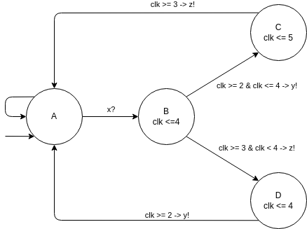
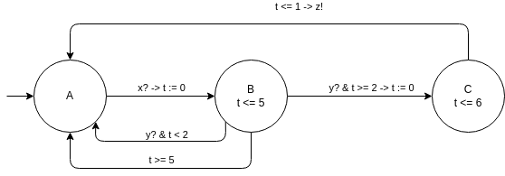
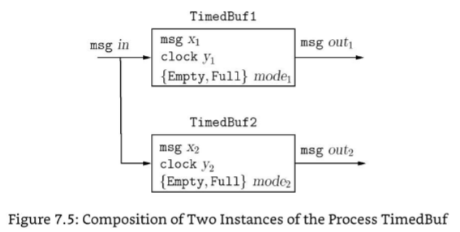
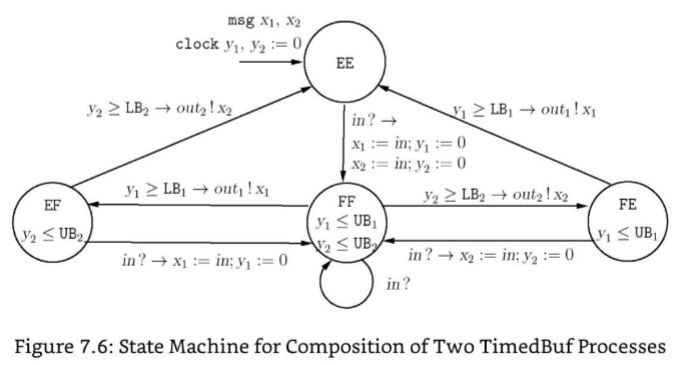
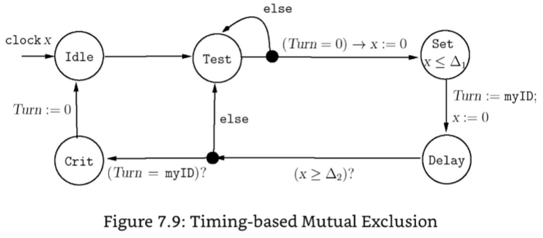

Calvin Passmore

A02107892

ECE 6790

# Homework 7

## Exercise 7.1: 
Consider a timed process with an input event x and two output events y and z. 
Whenever the process receives an input event on the channel x, it issues output events on the channels y and z such that (1) the time delay between x? and y! is between two and four units, (2) the time delay between x? and z! is between three and five units, and (3) while the process is waiting to issue its outputs, any additional input events are ignored.
Design a timed state machine that exactly models this description.

---

---
---

## Exercise 7.2: 
Consider a timed process with two input events x and y and an output event z.
Initially, the process is waiting to receive an input event x?.
If this event occurs at time t, then the process waits to receive an input on the channel y.
If the event y? occurs before time t+2 or does not occur before time t + 5, then the process simply returns to the initial state, and if the event y? is received at some time t' between times t + 2 and t + 5, then the process issues an output event on z at some time between times t' + 1 and t' + 6 and returns to the initial state. 
Unexpected input events (e.g., the event y in the initial mode) are 
ignored.
Design a timed state machine that exactly models this 
description.

---

---
---

## Exercise 7.4:
Figure 7.6 shows the product extended-state machine that captures the behavior of the composition of two instances of the timed process TimedBuf shown in figure 7.5.
Now consider the composition of two instances of the timed process TimedBuf connected in series as shown in figure 7.7.
Draw the extended-state machine with four modes and two clocks that captures the behavior of this composite process.

---

---
---

## Exercise 7.7:
For the timing-based mutual exclusion protocol of figure 7.9, consider the starvation-freedom requirement "if a process P enters the mode Test, then it will eventually enter the mode crit." 
Does the system satisfy the starvation-freedom requirement?
If not, show a counter-example.

---

Using discrete timing where &Delta;1 = 2 and &Delta;2 = 1

clock X  | P1    | P2   | TURN 
---------|-------|------|------
1        | IDLE  | IDLE |  0
2        | TEST  | IDLE |  0
3        | SET   | IDLE |  0
0        | DELAY | IDLE |  1
1        | DELAY | TEST |  1
2        | CRIT  | TEST |  1
3        | IDLE  | TEST |  0
4        | TEST  | TEST |  0
5        | SET   | TEST |  0
6        | DELAY | TEST |  1
7        | DELAY | TEST |  1

---
---

## Exercise 7.15:
Suppose a timed automaton has two clocks x1 and x2. Before entering a mode A, suppose we know that (3 <= x1 <= 4) and (1 <= x1 - x2 <= 6) and (x2 >= 0):

1. Show the DBM corresponding to the given
constraints.

2. Is the DBM in part (1) canonical? If not, obtain an
equivalent canonical form.

3. Suppose the clock-invariant of mode A is (x2 <= 5). 
Compute the canonical DBM that captures the set 
of clock values that can be reached as the process 
waits in mode A.

4. Consider a mode-switch out of mode A with 
guard (x1 >= 7) and update x1 := 0. Compute the 
canonical DBM that captures the set of clock 
values that are possible after taking this 
transition.

---

1.

x1 - x0 <= 3

x0 - x1 <= -4

x1 - x2 <= 6

x2 - x1 <= 1

x2 - x0 <= 0

x0 - x2 <= 0

|   | X0  | X1  | X2
|---|-----|-----|----
|X0 | 0   | -4  | 0
|X1 | 3   | 0   | 6
|X2 | 0   | 1   | 0

2.

x1 - x0 <= 3  & x2 - x1 <= 1 := x2 - x0 <= 4 <---- Not more restrictive

x1 - x0 <= 3  & x0 - x2 <= 0 := x1 - x2 <= 3

x0 - x1 <= -4 & x1 - x2 <= 6 := x0 - x2 <= 2 <---- Not more restrictive

x0 - x1 <= -4 & x2 - x0 <= 0 := x2 - x1 <= -4

x1 - x2 <= 6  & x2 - x0 <= 0 := x1 - x0 <= 6 <---- Not more restrictive

x2 - x1 <= 1  & x0 - x2 <= 0 := x0 - x1 <= 1 <---- Not more restrictive

|   | X0  | X1  | X2
|---|-----|-----|----
|X0 | 0   | -4  | 0
|X1 | 3   | 0   | 3
|X2 | 0   | -4  | 0

3.

x2 - x0 <= 5
x0 - x2 <= -5

|   | X0  | X1  | X2
|---|-----|-----|----
|X0 | 0   | inf | -5
|X1 | inf | 0   | inf
|X2 | 5   | inf | 0

|   | X0  | X1  | X2
|---|-----|-----|----
|X0 | 0   | -4  | -5
|X1 | 3   | 0   | 3
|X2 | 0   | -4  | 0

4.

(7 <= x1 <= 8) and (8 <= x1 - x2 <= 13) and (x2 >= 0) -> x := 0

x1 - x0 <= 8

x0 - x1 <= -7

x1 - x2 <= 13

x2 - x1 <= 8

x2 - x0 <= 0

x0 - x2 <= 0

|   | X0  | X1  | X2
|---|-----|-----|----
|X0 | 0   | -7  | 0
|X1 | 8   | 0   | 13
|X2 | 0   | 8   | 0

x1 := 0

|   | X0  | X1  | X2
|---|-----|-----|----
|X0 | 0   | -7  | 0
|X1 | 8   | 0   | 13
|X2 | 0   | 8   | 0

---
---
