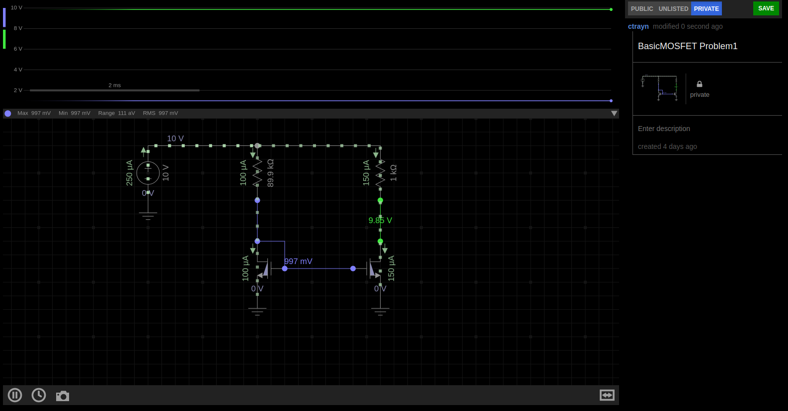
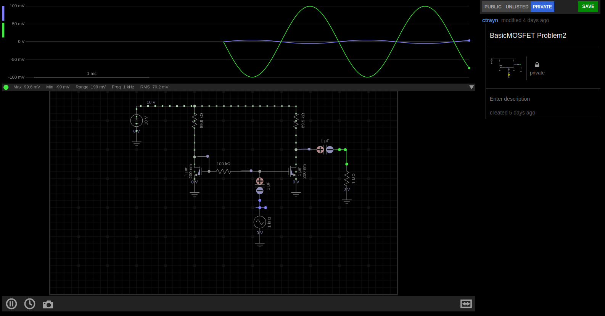
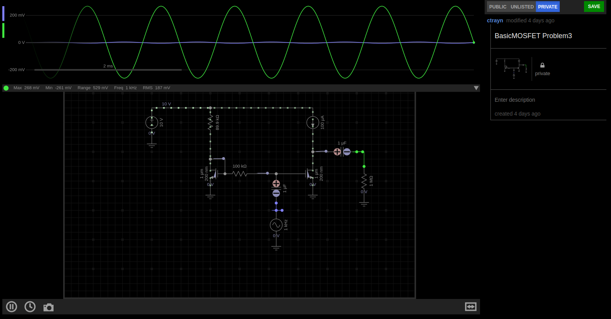
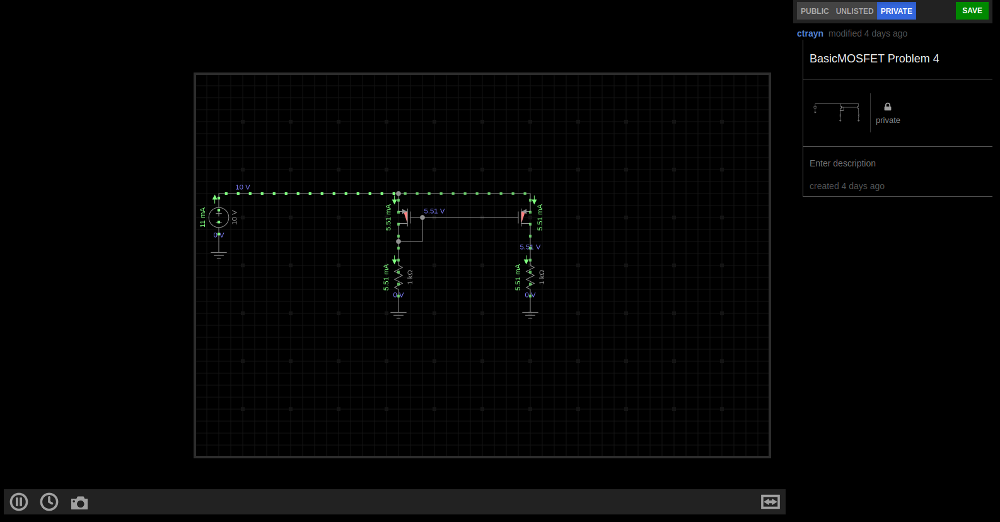
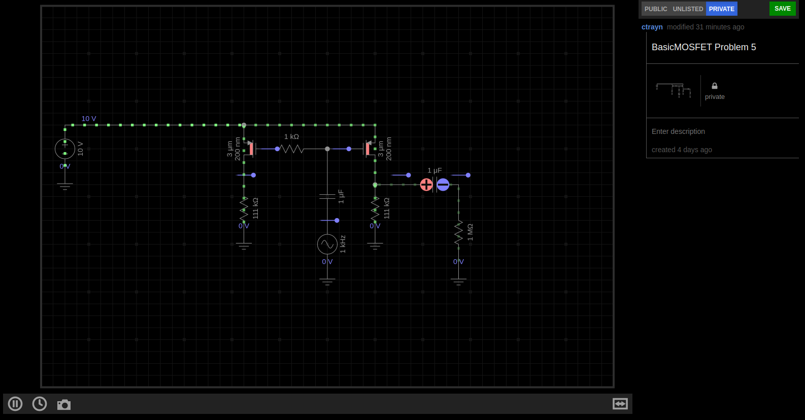
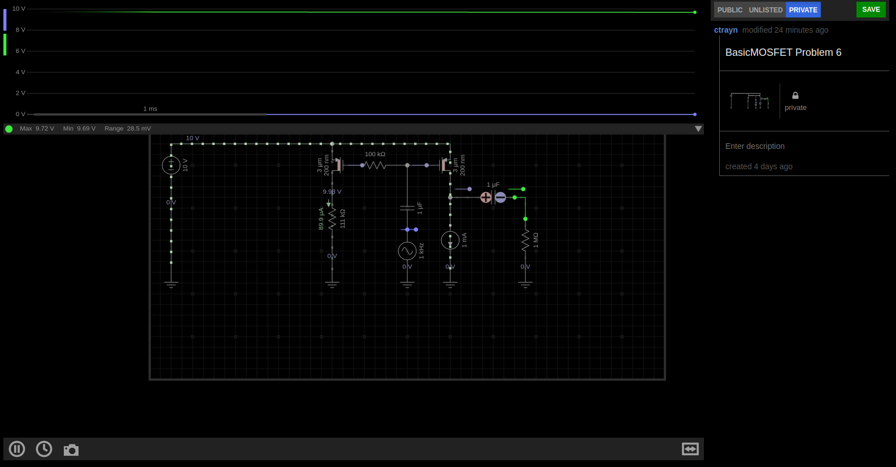

Calvin Passmore

A02107892

ECE 5420

# Basic Mosfets

I worked out all the math in python to facilitate changes my answers more easily.
Please see the attached python files and corresponding output.


## Problem1

### Source Code

```
from math import sqrt
from constants import *

V_DBias = sqrt(2 * IB / K_N) + V_THN
print(f"V_DBias: {V_DBias}")

R_Bias = (VDD - V_DBias) / IB
print(f"R_Bias: {R_Bias}")

Vov = V_DBias - V_THN
print(f"Vov: {Vov}")

RL = 1e3

IL = 0.5 * K_N * (Vov**2)
print(f"IL: {IL}")

VDL = IL*RL+VDD
print(f"VDL: {VDL}")

```

### Screenshot


### Answers

|     | Calculations | Simulations |
|-----|--------------|-------------|
| R   | 89 kOhm      |  89 kOhm    |
| VG  | 1.01 v       |  997 mV     |
| IL  | 100 uA       |  150 uA     |
| VD  | 10.1 v       |  9.85 v     |
-------------------------------
-------------------------------

## Problem2

### Source Code

```
from math import sqrt
from constants import *

R = 89.88e3

AV = -sqrt(2 * K_N * (VDD - V_THN) * R)
print(f"AV: {AV}")

ID = (VDD - V_THN)/R
print(f"ID: {ID}")

gm = sqrt(2 * K_N * ID)
r0 = 1/(LAMBDA_N * ID)
print(f"gm: {gm}")
print(f"r0: {r0}")
```

### Screenshot


### Answers

|     | Calculation | Simulation |
|-----|-------------|------------|
| gmn | 354 uA/V    | X          |
| r0n | 156.5 kOhm  | X          |
| Av  | -31.85      | 19.5       |
-------------------------------
-------------------------------

## Problem3

### Source Code

```
from cmath import sqrt
from cmd import IDENTCHARS
from constants import *

VG = V_THN + sqrt(2 * IB / K_N)

gm = sqrt(2 * K_N * IB)
r0 = 1 / (LAMBDA_N * IB)

Av = -gm * r0

print(f"Av: {Av}")
print(f"gm: {gm}")
print(f"r0: {r0}")

```

### Screenshot


### Answers

|     | Calculation | Simulation |
|-----|-------------|------------|
| gmn | 343.5       | X          |
| r0n | 166.6 kOhm  | X          |
| Av  | -57.25      | 52.9       |
-------------------------------
-------------------------------

## Problem4

### Source Code

```
from math import sqrt
from constants import *

Vov = sqrt(2 * IB / K_P)
VGS = -1 * (Vov + V_THP - VDD)
VG = VDD - VGS
R = VG / IB

RL = 1e3
IL = 0.5 * K_P * (Vov**2)
VDL = IL * RL

print(f"R : {R}")
print(f"VG: {VG}")
print(f"IL: {IL}")
print(f"VDL: {VDL}")
```

### Screenshot


### Answers

|     | Calculations | Simulations |
|-----|--------------|-------------|
| R   | 10.6 kOhm    | 10.6 kOhm   |
| VG  | 1.06         | 7.95        |
| IL  | 1.0 uA       | 750uA       |
| VD  | 0.01         | 7.95        |
-------------------------------
-------------------------------

## Problem5

### Source Code

```
from cmath import sqrt
from constants import *
from Problem4 import R

Vg = 0
Vov = Vg - VDD - V_THP
VD = R/2 * K_P * (Vov**2)
IL = 0.5 * K_P * (Vov**2)
r0 = 1 / (LAMBDA_P * IL)
gm = sqrt(2 * K_P * IL)
Av = (gm*r0)/(gm + r0)

print(f"R: {R}")
print(f"gm: {gm}")
print(f"r0: {r0}")
print(f"Av: {Av}")
```

### Screenshot


### Answers

|     | Calculation | Simulation |
|-----|-------------|------------|
| gmn | 4.73 mA/V   | X          |
| r0n | 406.9 Ohm   | X          |
| Av  | 4.73 mV/V   | Everycircuit says it's close to 0 |
-------------------------------
-------------------------------

## Problem6

### Source Code

```
from constants import *
from math import sqrt

Vov = sqrt(2 * IB / K_P)
Vg = Vov + VDD + V_THP
R = Vg / IB
gm = sqrt(2 * K_P * IB)
r0 = 1/(LAMBDA_P * IB)
Av = -1 * gm * r0


print(f"R: {R}")
print(f"gm: {gm}")
print(f"r0: {r0}")
print(f"Av: {Av}")
```

### Screenshot


### Answers

|     | Calculation | Simulation |
|-----|-------------|------------|
| gmn | 301 uA/V    | X          |
| r0n | 100 kOhm    | X          |
| Av  | -30.15      | Everycircuit says it's close to 0 |
-------------------------------
-------------------------------

## Problem7

### Source Code

```
from constants import *
from Problem6 import R, gm, r0
```

### Screenshot


### Answers

|     | Calculation | Simulation |
|-----|-------------|------------|
| Av  | -30.15      | 23.19      |
-------------------------------
-------------------------------