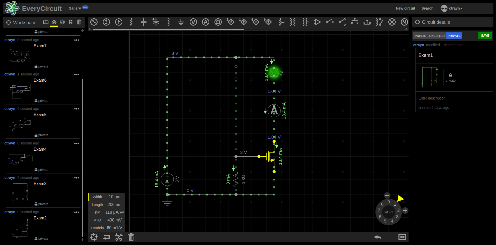
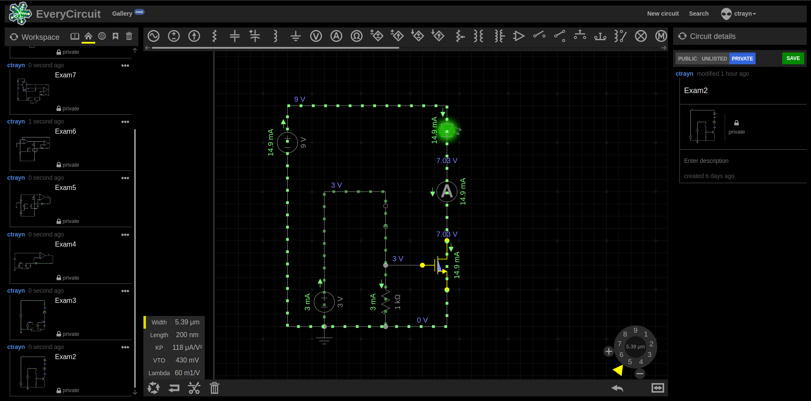

Calvin Passmore

A02107892

ECE 5420

# Exam: Analog Circuits

## Problem 1

//TODO Attach work

The simulation matched the calculations fairly closely but was not exact. This is somewhat due to rounding errors from the start of the problem and in the simulation.

The calculated results:

Adjusting the simulation to give a perfect 15mA:

## Problem 2

This time, I used the initial current from the EveryCircuit simulation which was 2.78mA to calculate the needed width of the NMOS which was 5.396 $\mu$ m. This reduced the rounding and conversion errors to that setting the NMOS width to 5.39 $\mu$ m resulting in a current of 14.9 mA.

## Problem 3