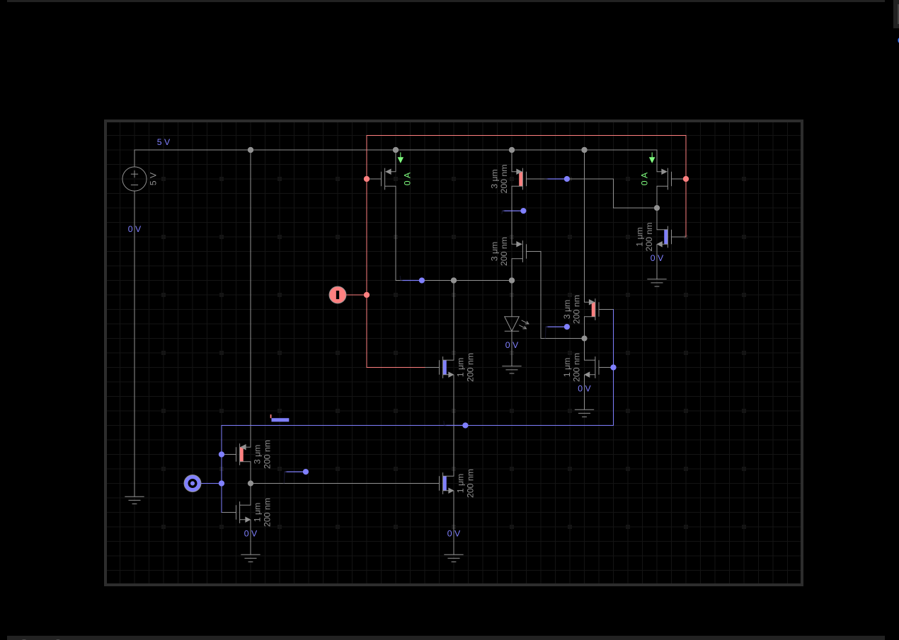

Calvin Passmore

A02107892

ECE 5420

# Exam Digital

## Problem 1

Below are the pictures of the AND gate implementation. First, the two input clocks, then the output Q and then all together.

## Problem 2

The intended function of the circuit is to switch the output when both inputs have switched.

It was previously not working because the middle logic source was on, allowing the bottom signal to impact the output when it was not supposed to and preventing the output from reaching 0.

## Problem 3

I am a little confused by this problem. The problem statement says memristors are being used, but that's not reflected in the EveryCircuit simulation.
I'm going to answer as if memristors were being used, but that limits me in what I can show in EveryCircuit.

I will include screenshots of accessing each cell, and each word (assuming words are left to right).

If there were memristors involved, having a voltage difference over them (but not enough to change its resistance) would let you READ the memristor.
This could be done words at a time.

To WRITE to a memristor you show enough voltage which would induce a large current to change the memristor's value.

## Problem 4

I have included pictures of each logic state, and an LED indicating *Q*. Each logic state is shown.

Also, below is the schematic of what I implemented in EveryCircuit.

## Problem 5

This senses A being 1.0 and resolves Q to 0v

S1 | S2 | S3 | S4
---|----|----|----|
?  | 0  | 0  | 0
?  | 0  | 1  | 0
?  | 0  | 0  | 0
A  | 0  | 0  | 0
A  | 1  | 0  | 0
A  | 0  | 0  | 0
A  | 0  | 0  | 1

This senses B being 1.1 and resolves Q to 3v

S1 | S2 | S3 | S4
---|----|----|----|
?  | 0  | 0  | 0
?  | 0  | 1  | 0
?  | 0  | 0  | 0
B  | 0  | 0  | 0
B  | 1  | 0  | 0
B  | 0  | 0  | 0
B  | 0  | 0  | 1

The above tables describe the switch sequence of S3, S1, S2, S4

