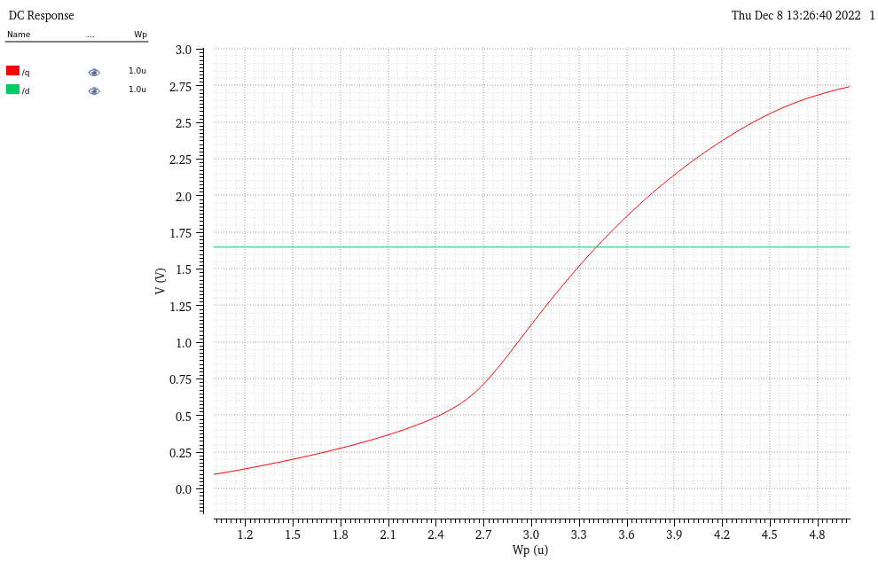
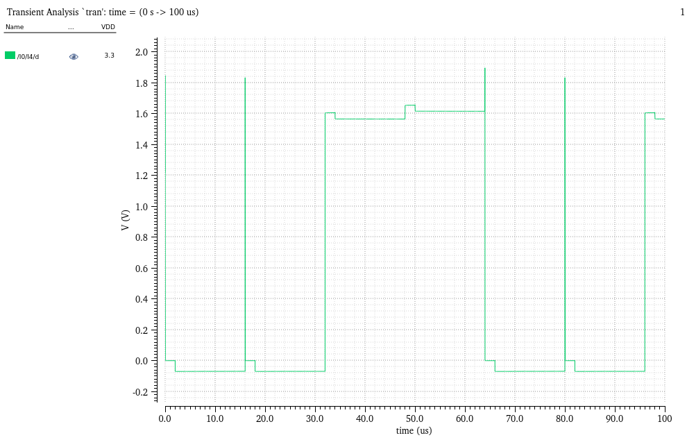

Calvin Passmore

A02107892

ECE 5420

# DRAM Lab Report

## PMOS Width

Here is my calulations

    Wp = Wn (un/up)((Vthn - Vdd/2)/(Vthp - Vdd/2))^2

    Wp = (1u)(524/202.5)((0.7086 - 3.3/2)/(0.918 - 3.3/2))^2

    Wp = 3.4 um

The simulation gave the following: 



Resulting in a PMOS width of approximately 3.4 um

### Inverter Crossover Voltage

Doing the calculations, Vc = 1.69 v

Vc = (&#8730;(Kn) + Vthn + &#8730;(Kp) * (Vdd - |Vthp|)) / (&#8730;(Kn) + &#8730;(Kp)

```py
from math import sqrt

KN = 261e-6
KP = 331e-6
VTHN = 0.7086
VTHP = 0.918
VDD = 3.3

Vc = ((sqrt(KN) * VTHP) + (sqrt(KP) * (VDD - VTHP))) / (sqrt(KN) + sqrt(KP))

print(Vc)
```

Vc = 1.6934

Doing the simulation gives us


Vc ~= 1.69 v

## Tail Current and Reference Resistor

    x = Vdd/2 = 1.65
    Vgsp = Vdd/2 = 1.65
    Vovp = Vdd/2 = Vthp = 1.65 - 0.918 = 0.73 -> saturation
    id = 0.5 * Kp * Vov^2 = 88.7 uA
    NMOS -> 88.7 = 0.5 * Kn * Vovn^2 => Vovn = sqrt(2*88.7 u / 261u) = 0.481 v
    Vgs - Vthn = 0.481 => Vgs = 0.481 + Vthn = 1.189 => Vg - Vs = 1.65 - Vs
    Vs = 1.65 - 1.19 = 0.461 v

    NMOS at the bottom of the OTA
    id = 2 * 88.7 uA = 177.4 uA
    177.4 = 0.5 * Kn * Vov^2 => Vov = 0.961
    Vgs - Vth = Vg - Vs - Vthn where Vs = GND
    Vg = 0.961 + Vthn = 1.669

    NMOS in series with the resistor
    id = 0.5 * Kn * Vov^2 = 0.5 * Kn * (Vgs - Vthn) = 120.5 uA
    R = (3.3 - 1.669) / 120.5 uA = 13.5 kOhm

The Virtuoso Simulation gives


13.5 kOhm

## Complete the crossbar address decoder


## Predict the Bump Voltage

```py
CD = 30e-15
CBL = 3e-12
VDD = 3.3
VTH = 0.7086

V1 = (((VDD/2) - VTH) * CD) / (CBL + CD)
V0 = (-CD * VDD / 2) / (CBL + CD)

print(f"Vbump 1 = {V1}")
print(f"Vbump 0 = {V0}")
```

V1 = 9.3mV
V0 = -16mV

The simulation gives this


V1sim ~= 20mV
V0sim ~= 40mv

Below are the measurements for WL, BL, S and D





Changing the capacitance to 131p breaks the DRAM where it reads a wrong value. 130p also showed significant signal loss, but still well above Vdd/2


