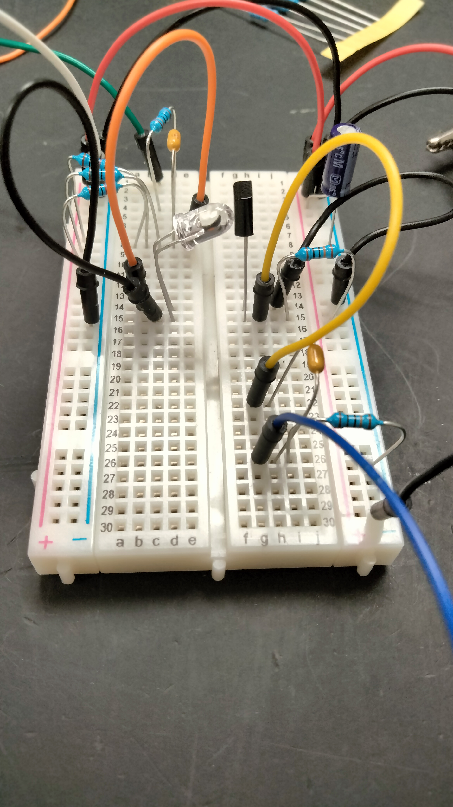
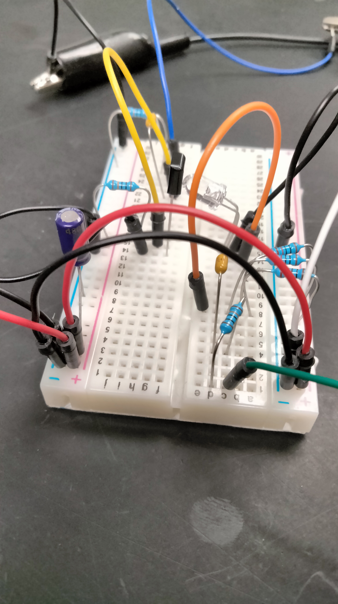

Calvin Passmore

A02107892

ECE 5420

# Optoelectronics Physical Lab

I did setup the physical circuit, but due to lab equipment limitations in EL104, I wasn't able to get precise measurements. I also wasn't able to get a sin wave to show on the oscilloscope, but I think it's due to the signal loss across the circuit.

Here are the images of the circuit that I set up:

Top:

Front:

Back:

Right:

Left:

And these are what I was reading out of the oscilloscope:

