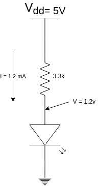
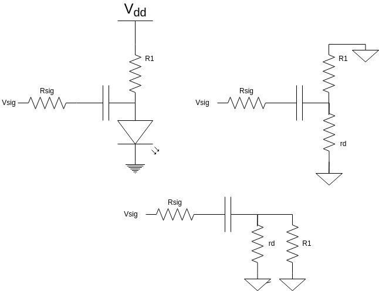
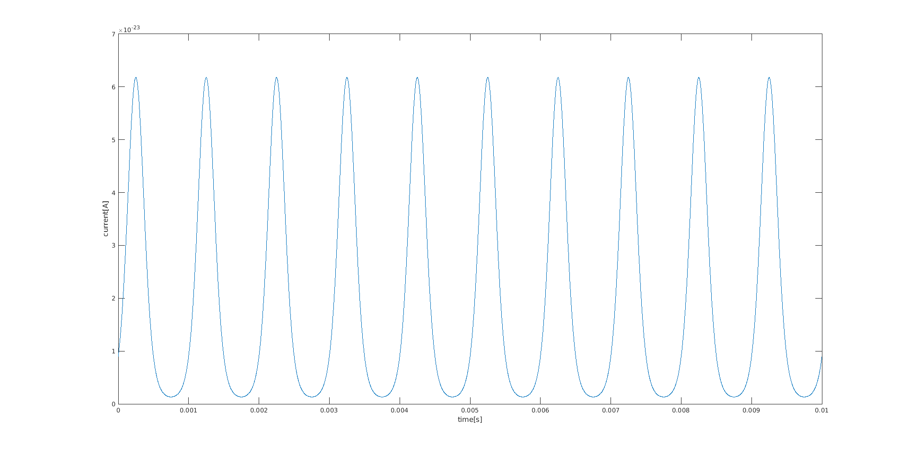
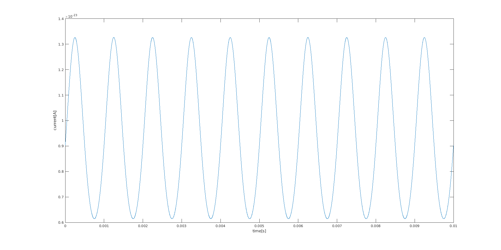
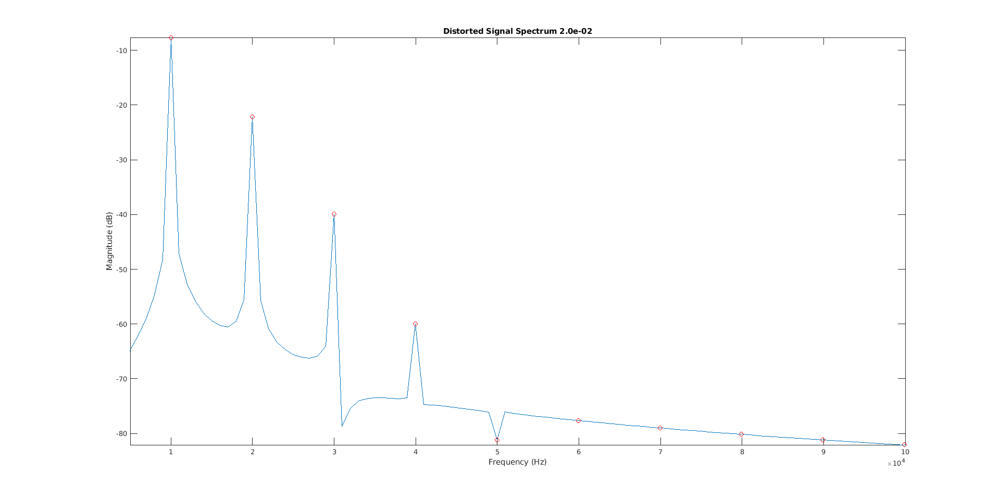
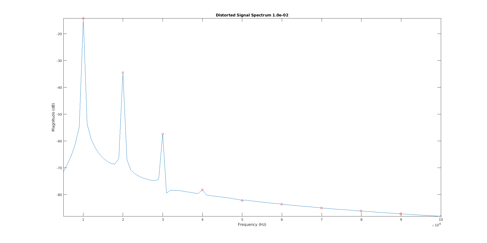
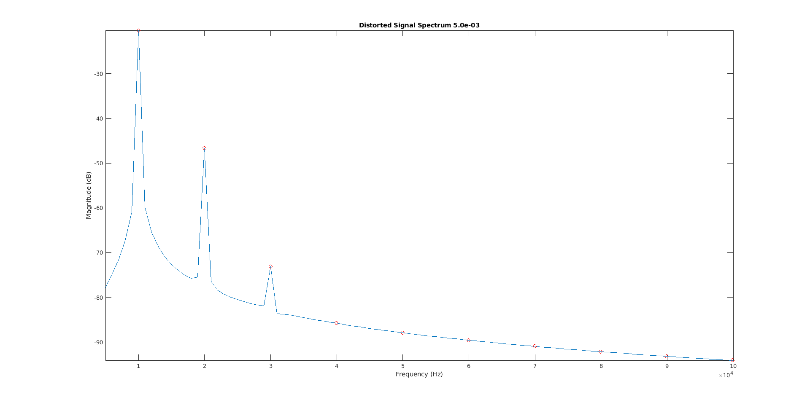

Calvin Passmore

A02107892

ECE 5420

# Optoelectronics Pre Lab

## DC Operating Point: Transmit Side



    I_LED = 1 mA
    V_F = 1.2 v
    
___
___

## DC Operating Point: Receive Side


    I_PH = 12 uA
    Vy = 3.7 v

___
___

## Minimum Signal Frequency

### Transformation
Showing the transformation of the circuit to small signal.



### High-pass filter

$$ H(s) = sRC/(1 + sRC) $$

where R = $ R_{sig}(R_1 + r_d) + R_1r_d \over R_1 + r_d$

$$ H(s) = {sC (R1 || rd) \over 1 + sC ({R_{sig} R_1 + R_{sig}r_d + R_1r_d)\over R_1 + r_d})}$$

---
---

### Low-Frequency Cutoff

$$ f_L = {1 \over 2 \pi RC} $$

where R = $ R_{sig}(R_1 + rd) + R_1 r_d \over R_1 + r_d$

$$ f_L = {1 \over 2 \pi C{(R_{sig}(R_1 + r_d) + R_1 r_d) \over R_1 + r_d}} $$

$$ f_L = {R_1 + r_d \over 2\pi C [R_{sig}(R1 + rd) + R1rd]}$$

$ R1 >> rd $, so $R_1 + r_d \approx R_1$

$$ f_L \approx {1 \over 2\pi C(R_{sig} + rd)}$$

$ C = 1\mu F$

$ R_{sig} = 100k\Omega$

$ r_d = 25\Omega$

```​
fL = 1.6 Hz
```
---
---
## Maximum Signal Frequency

$$ V_R = 3.7 \therefore C_j = 26 pF$$

$$ f_H = {1 \over 2\pi RC} $$
$$ f_H = {1 \over 2\pi C(R_{sig} + rd)} = 1.84 Hz$$

---
---

## Signal Distortion: Forward Bias LED

Forward Bias current at 0.05 v



Forward Bias current at 0.05 v



---
---
## MatLab Data

    >> plot_signal_spectrum(0.02)
    THD: 17.776924%
    SNDR: 14.524570 dB



    >> plot_signal_spectrum(0.01)
    THD: 9.486085%
    SNDR: 20.388633 dB



    >> plot_signal_spectrum(0.005)
    THD: 4.997734%
    SNDR: 26.366854 dB


