Calvin Passmore

A02107892

ECE 5420

First output:

    nvx = 1.247910e+00
    nvy = 3.788906e-01
    i(vm1) = 1.136997e-03
    i(vm2) = 3.332524e-05

This was close to the expected values.

Transient Solution

```
Initial Transient Solution
--------------------------

Node                                   Voltage
----                                   -------
nvdd                                         5
nsig                                         0
nvx                                    1.24791
nled                                   1.24791
nvy                                   0.378891
npd                                   0.378891
nvsig                                  1.24791
nc                                     1.24791
nvout                                 0.378887
vm1#branch                            0.001137
vm2#branch                         3.33252e-05
vsig#branch                                  0
vdd#branch                         -0.00118321
```

sim1 png output
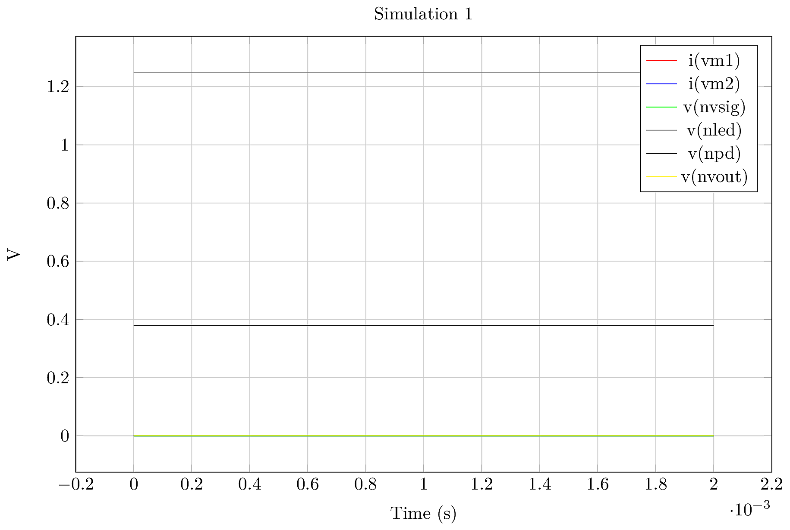

**MATLAB STUFF TODO**

```
Fourier analysis for v(nvout):
  No. Harmonics: 10, THD: 73.5045 %, Gridsize: 200, Interpolation Degree: 1

Harmonic Frequency   Magnitude   Phase       Norm. Mag   Norm. Phase
-------- ---------   ---------   -----       ---------   -----------
 0       0           -1.4001e-06 0           0           0          
 1       5000        8.90459e-11 -179.1      1           0          
 2       10000       4.45281e-11 -178.2      0.500058    0.901387   
 3       15000       2.96904e-11 -177.3      0.333428    1.80209    
 4       20000       2.22746e-11 -176.4      0.250147    2.70049    
 5       25000       1.78105e-11 -175.48     0.200014    3.62102    
 6       30000       1.48622e-11 -174.6      0.166904    4.50241    
 7       35000       1.27466e-11 -173.7      0.143147    5.39605    
 8       40000       1.11597e-11 -172.81     0.125325    6.28972    
 9       45000       9.92586e-12 -171.91     0.111469    7.18534    
```

Matlab FFT
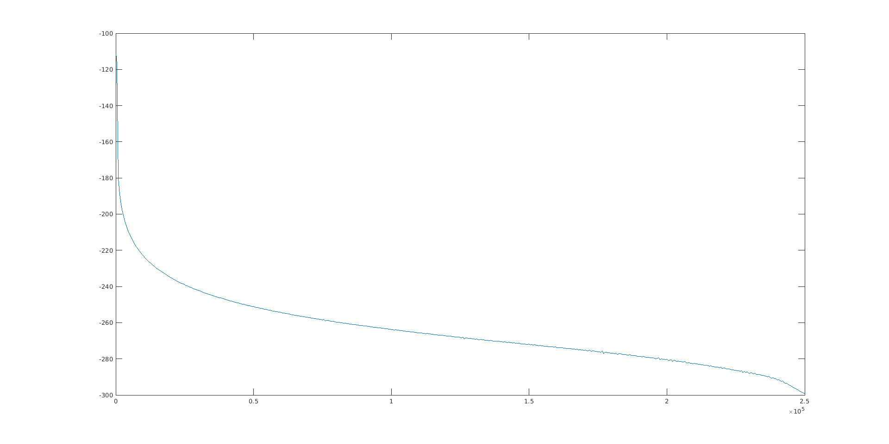

```
maxdb               =  -inf at=  1.000000e+06
Error(checkvalid): vector inf is not available or has zero length.
Error: RHS " -inf" invalid
Error(checkvalid): vector maxdb is not available or has zero length.
Error: RHS "maxdb - 3.0" invalid

Error: measure  fl  find(AT) : out of interval
 meas ac fl find frequency when vdb(nvout)=cutoffmag failed!


Error: measure  f2  find(AT) : out of interval
 meas ac f2 find frequency when vdb(nvout)=cutoffmag cross=last failed!

Error: &maxdb: no such variable.
Max dB = 
Error: &fl: no such variable.
Lower Cutoff Frequency = 
Error: &f2: no such variable.
Higher Cutoff Frequency = 
```

---
---

A = 0.02

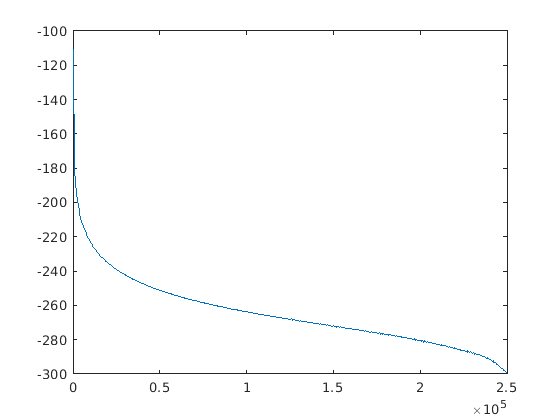
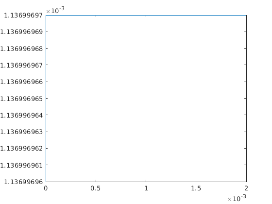
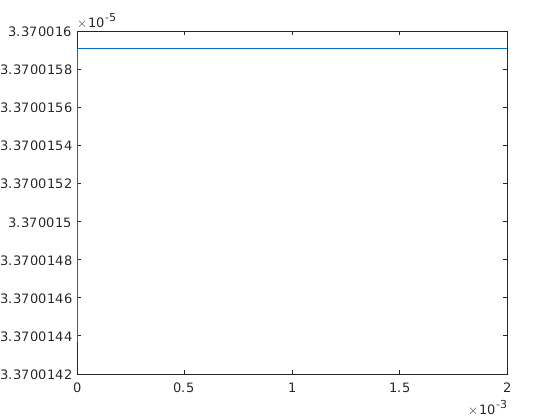
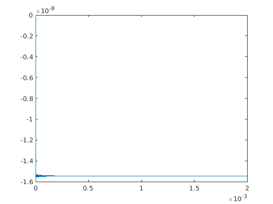
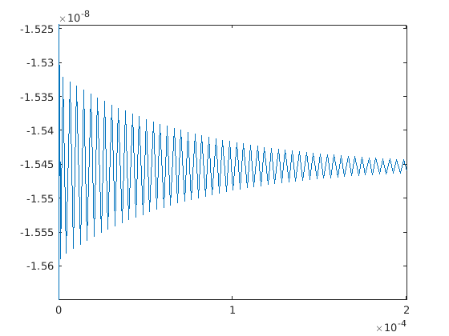
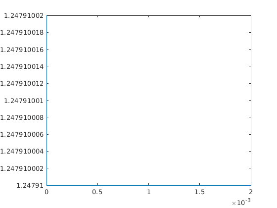
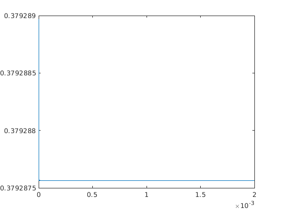

---
---

A = 0.01


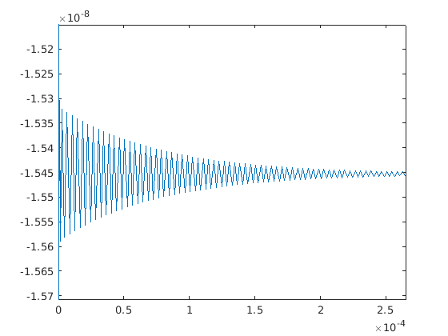


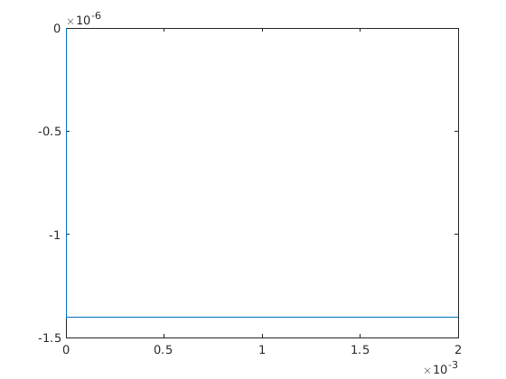

---
---

A = 0.005


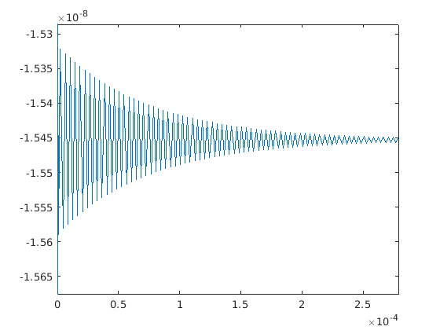


