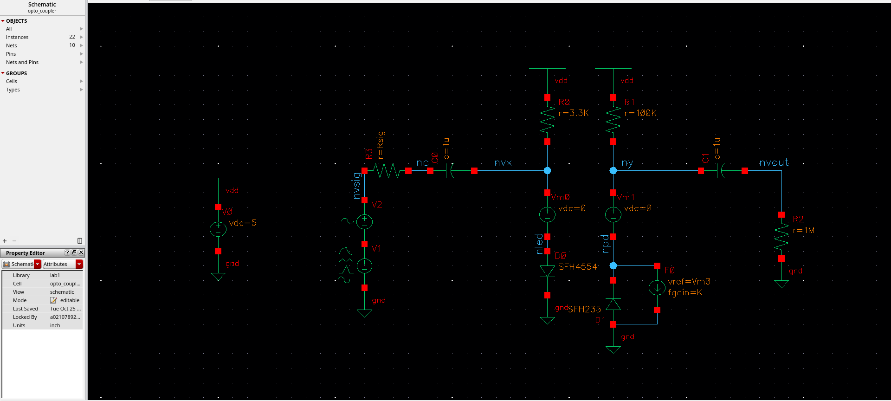
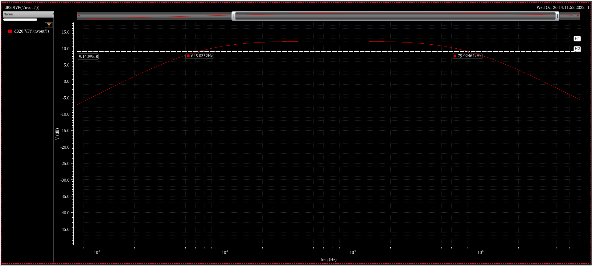
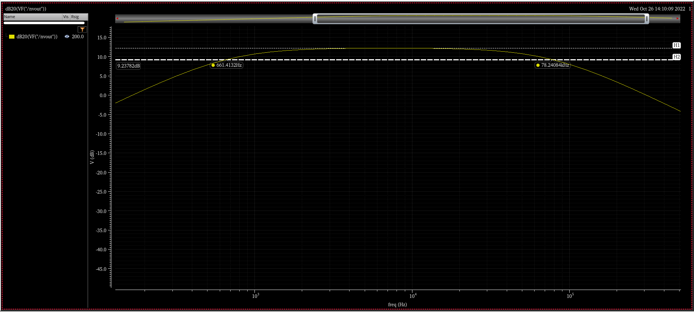
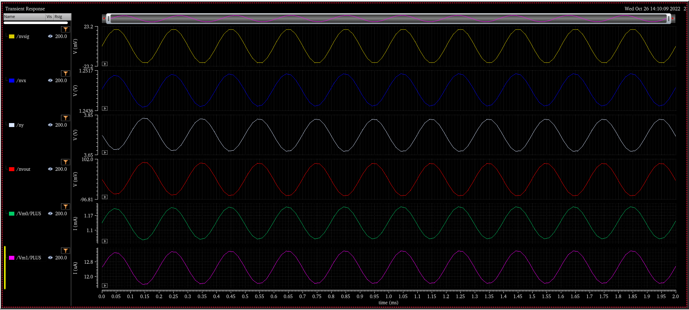
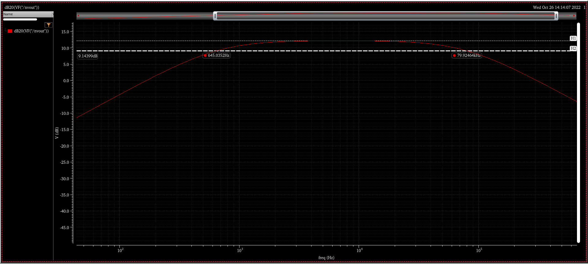
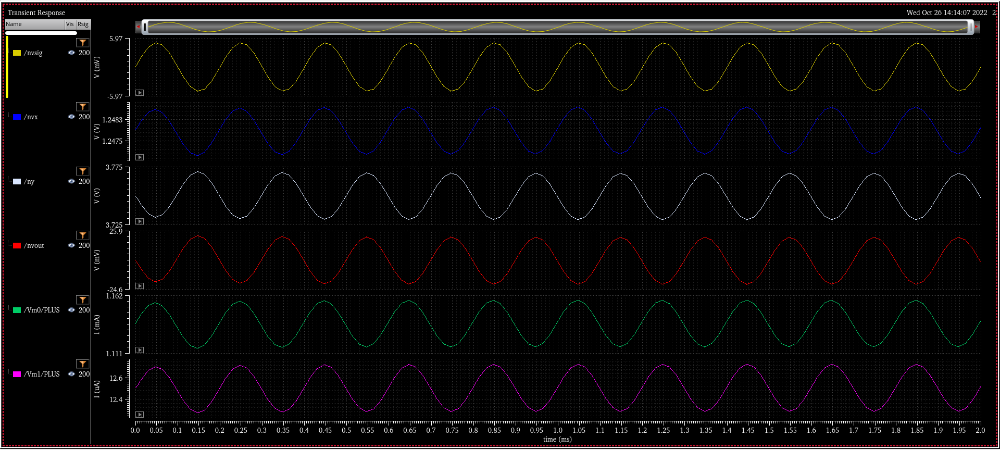

Calvin Passmore

A02107892

ECE 5420

# Optoelectronics Cadence

I followed the tutorial videos for going through the Cadence software and outputting the waveforms.

Here is the circuit modeled:

---
---

Here are the AC and transient response waveforms for the various amplitudes:

A = 0.01

---

A = 0.02

---

A = 0.005

---
---

## 3dB Points
|  A   | Low 3dB [Hz] | High 3dB [Hz] |
|------|--------------|---------------|
| 0.01 | 645.0352     | 79.92464 k    |
| 0.02 | 661.4132     | 78.24084 k    |
| 0.005| 645.0352     | 79.92464 k    |

