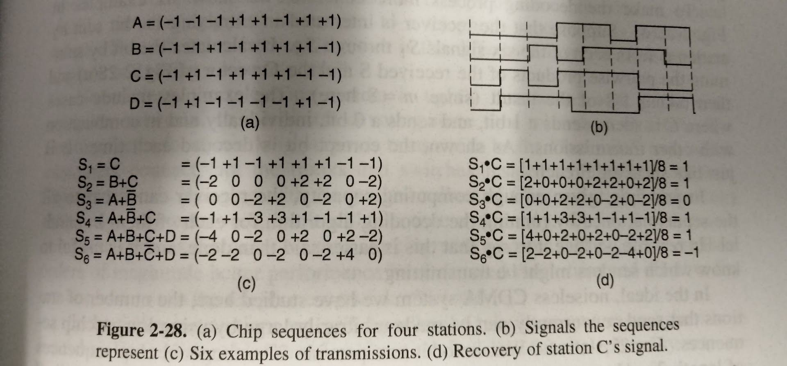
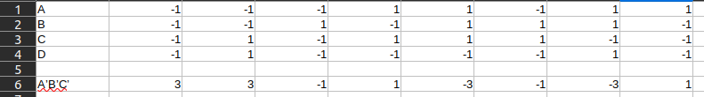
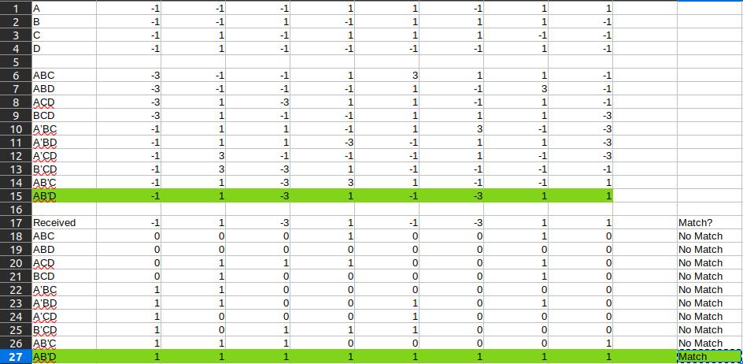
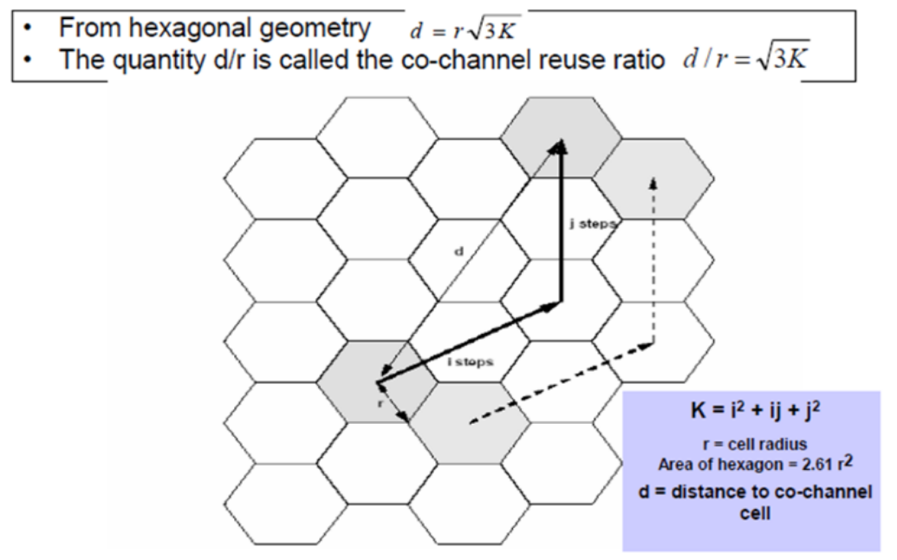

Calvin Passmore

A02107892

ECE 5600

# Homework 3

## 2.28
Compare the maximum data rate of a noiseless 4-kHz channel using 

(a) Analog encoding (e.g. QPSK) with 2 bits per sample.

(b) The T1 PCM system.

---

    In both cases, 8000 sample/sec is possible. With dibit encoding, 2 bits per sample are sent; with T1, 7 bits are sent

---
---

## 2.38

Compare the delay in sending an $x$-bit message over a $k$-hop path in a circuit-switched network and in a (lightly loaded) packet-switched network. The circuit setup time is a sec, the propagation delay is $d sec$ per hop, the packet size is $p$ bits, and the data rate is $b$ bps. Under what conditions does the packet network have a lower delay? Also, explain the conditions under which a packet-switched network is preferable to a circuit switched network.

---

Circuit switched only needs to setup hops once, then the circuit stays in place until done. So the setup time is the longest part, but it also restricts other network activity.

A packet switched network needs to 'setup' the network everytime a packet is sent.

A packet network has a lower delay when there are few hops. A packet switched network is prefereable when multiple users want to use the same network at once.

---
---

## 2.44

Suppose that $A$, $B$, and $C$ are simultaneously transmitting 0 bits, using a CDMA system with the chip sequences of Fig. 2.28(a). What is the resulting chip sequence?

---

    A'B'C' = (3 + 3 - 1 + 1 - 3 - 1 - 3 + 1)

---
---

## 2.46

A CDMA receiver gets the following chips: (-1 + 1 -3 + 1 -1 -3 + 1 + 1). Assuming the chip sequences defined in Fig. 2-28(a), which stations transmitted, and which bits did each one sends?

---

    A sent 1
    B sent 0
    C didn't send
    D sent 1

---
---

## 5.27

Convert the IP address whose hexadecimal representation is C22F1582 to dotted decimal notation.

---

    194.47.21.130

---
---

## 5.28

A network on the Internet has a subnet mask of 255.255.240.0. What is the maximum number of hosts it can handle?

---

    255.255.255.240 = 0xFFFFFFF0
    0xF or 16 hosts

---
---

## 5.30

A large number of consecutive IP addresses are available starting at 198.16.0.0. Suppose that four organizations $A$, $B$, $C$, and $D$, request 4000, 2000, 4000, and 8000 addresses, respectively, and in that order. For each of these, give the first IP address assigned, the last IP address assigned, and the mask in the $w.x.y.z/s$ notation.

---

198.16.0.0 => 0xC610_0000

2000 => 0x7D0

4000 => 0xFA0

8000 => 0x1F40

    A = 198.16.0.0    - 198.16.15.159 /21
    B = 198.16.15.160 - 198.16.23.111 /21
    C = 198.16.23.112 - 198.16.39.15  /21
    D = 198.16.39.16  - 198.16.70.79  /21

---
---

## 5.33

A router has the following (CIDR) entries in its routing table:

| Address/mask | Next hop |
|--------------|----------|
| 135.46.56.0/22 | Interface 0
| 135.46.60.0/22 | Interface 1
| 192.53.40.0/23 | Router 1
| default | Router 2

For each of the following IP addresses, what does the router do if a packet with that address arrives?

(a) 135.46.63.10

(b) 135.46.57.14

(c) 135.46.52.2

(d) 192.53.40.7

(e) 192.53.56.7

---

    (a) Interface 1
    (b) Interface 0
    (c) Interface 0
    (d) Router 1
    (e) Router 2

---
---

## 5.32

The set of IP addresses from 29.18.0.0 to 29.18.127.255 has been aggregated to 29.18.0.0/17. However, there is a gap of 1024 unassigned addresses from 29.18.60.0to 298.18.63.255 that are now suddenly assigned to a host using a different outgoing line. is it now necessary to split up the aggregate addresses into its constituent blocks, add the new block to the table, and then see if any re-aggregation is possible? If not, what can be done instead?

---

    Yes, it would be necessary to split up the aggregate, add the block to the routing table, and then hopefully re-aggregate.

---
---

## 5.35

You have just explained the ARP protocol to a friend. When you are all done, he says: "I've got it. ARP provides a service to the network layer, so it is part of the data link layer." What do you say to him?

---

    ARP is actually said to be part of the link layer
    
---
---

## Extra Problem

Assume $K = i^2 + ij + j^2$. Please prove $d = r \sqrt{3K}$

---

r' = radius to flat edge

$d^2 = (i 2r')^2 + (j 2 r')^2 + -2 i (2r') j (r') cos(120)$

$d^2 = (i^2 + j^2)(2 r')^2 + ij(2 r')^2$

$d^2 = (2r')(i^2 + j^2 + ij)$

$k = (i^2 + ij + j^2)$

$(2r')^2 = 3r^2$

$d^2 = 3r^2K$

$d/r = \sqrt{3K}$

---
---