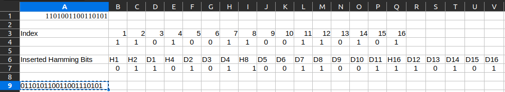

Calvin Passmore

A02107892

ECE 5600

# 3.1 

An upper-layer packet is split into 10 frames, each of which has an 80% chance of arriving undamaged. If no error control is done by the data link protocol, how many times must the message be sent on average to get the entire thing through?

---

p  = 0.8 10 = 0.1074

E = 1/p = <u>9.31 times</u>

---
---

# 3.2

The following character encoding is used in a data link protocol:

    A:    01000111
    B:    11100011
    FLAG: 01111110
    ESC:  11100000

Show the bit sequence transmitted (in binary) for the four-character frame A B ESC FLAG when each of the following frame methods is used:

1. Byte count
2. Flag bytes with byte stuffing
3. Starting and ending flag bytes with bit stuffing

---

1. 00000100 01000111 11100011 11100000 01111110
2. 01000111 11100011 11100000 11100000 11100000 01111110
3. 01111110 01000111 11100011 11100000 11100000 11100000 01111110 01111110

---
---

# 3.3

The following data fragment occurs in the middle of a data stream for which the byte-stuffing algorithm described in the text is used: A B ESC C ESC FLAG FLAG D. What is output after stuffing?

---

    A B ESC ESC C ESC ESC ESC FLAG ESC FLAG D

---
---

# 3.4

What is the maximum overhead in the byte-stuffing algorithm?

---

Byte stuffing could double the packet size if all the bytes in the data were ESC of FLAG, making the overhead 100%.

---
---

# 3.6

A bit string, 0111101111101111110, needs to be transmitted at the data link layer. What is the string actually transmitted after bit stuffing?

---

011110111110011111010

---
---

# 3.8

To provide more reliability than a single parity bit can give, an error-detecting coding scheme uses one parity bit for checking all the odd-numbered bits and a second parity bit for all the even-numbered bits What is the Hamming distance of this code?

---

Its hamming distance is 2.

---
---

# 3.9

Sixteen-bit messages are transmitted using a Hamming code. How many check bits are needed to ensure that the receiver can detect and correct single-bit errors? Show the bit pattern transmitted for the message 1101001100110101. Assume that even parity is used in the Hamming code.

---

5 check bits are needed because the check bits will increase the data size beyond 16 bits.

    pp1p101p001100110p101 -> 1p1p101p001100110p101

    

    011010110011001110101

---
---

# 3.11

One way of detecting errors is to transmit data as a block of *n* rows of *k* bits per row and add parity bits to each row and each column. The bit in the lower-right corner is a parity bit that checks its row and its column. Will this scheme detect all single errors? Double errors? Triple errors? Show that this scheme cannot detect some four-bit errors.

---

This method would detect all single errors, but it would not detect double errors if they occured in the same row, or in right column. This method would detect some triple errors, but not necessarily all of them depending on their placement.

For four bit errors if this was a single row originally

    010101010101 parity 0

And the received line is

    000000000101 parity 0

The reciever could not detect this because the parity is correct.

---
---

# 3.12

Suppose that data is transmitted in block sizes 1000 bites. What is the maximum error rate under which error detection and retransmission mechanisms (1 parity bit per block) are better than using Hamming code? Assume that bit errors are independent of one another and no bit error occurs during transmission.

---

If the maximum number of errors doesn't exceed 1, parity bits would be better than a Hamming code because it will use less bits to detect the error. However, parity bits could never correct the error.

---
---

# 3.13

A block of bits with *n* rows and *k* columns uses horizontal and vertical parity bits for error detection. Suppose that exactly 4 bits are inverted due to transmission errors. Derive an expression for the probability that the error will be undetected.

---

Probability of getting two errors in any particular row where `p` is the probability of error

    p * 1/n

To get four errors in one row (resulting in undetection)

    (p/n) * (p/n) * (p/n) * (p/n) = (p/n)^4

Probability to get 2 errors in one row and two errors in another row

    (p/n)^2 + (p/n)^2 = 2(p/n)^2

Combining these gives

    (p/n)^4 + 2(p/n)^2

---
---

# 3.15

Suppose that a message 1001 1100 1010 0011 is transmitted using Internet Checksum (4-bit word). what is the value of the checksum?

---

     1001
     1100
     1010
     0011
    +-----
     0010

---
---

# 3.17

A bit stream 10011101 is transmitted using the standard CRC method described in the text. The generator polynomial is `x^3 + 1`. Show the actual bit string transmitted. Suppose that the third bit from the left is inverted during transmission. Show that this error is detected at the receiver's end. Give an example of bit errors in the bit string transmitted that will not be detected by the receiver.

---

         __________
    1001 | 10011101
           1001
           ----
           0000
               1101
               1001
               ----
               0100

Actual Transmitted

    10011101 0100

String changed to 10111101, the CRC would be changed to 

         __________
    1001 | 10111101
           1001
           ----
           0010
             1011
             1001
             ----
             0010
               1001
               1001
               ----
               0000

The resulting CRC is `0000`, which is different from the original CRC showing that the error would be detected.

A bit string with errors that would not show detection is

    10111001

    1001 | 10111001
           1001
           ----
           001010
             1001
             ----
             001101
               1001
               ----
               0100

---
---

# 3.20

A channel has a bit rate of 4 kbps and a propagation delay of 20 msec. For what range of frame sizes does stop-and-wait give an efficiency of at least 50%?

---

efficiency = Transmission_time/(Transmission_time + 2 * propagation_time)

Transmission time = nbits/4000 seconds

Frame size of 160 would give exactly 50% efficiency. Anything more would give more efficiency

---
---

# 3.22

A 3000-km-long T1 trunk is used to transmit 64-byte frames using protocol 5. If the propagation speed is 6 \mu sec/km, how many bits should the sequence numbers be?

---

Max window size = 1 + 2a

Bandwidth of T1 trunk = 1.544 Mbps

Transmission Delay = Length of Frame/Bandwidth = `64*8/1.544*10^6 = 0.331ms`

Propogation delay = `6 * 3000 / 10^6= 18 ms`

a = `T_P/T_t = 18/0.331 = 54.3`

N = 1 + 2a = 110

`log_2(110) = 7`

---
---

# 3.27

The distance from the earth to a distant planet is approximately `9 x 10^10` m. What is the channel utilization if a stop-and-wait protocol is used for frame transmission on a 64 Mbps point-to-point link? Assume that the frame size is 32 KB and the speed of light is `3 x 10^8 m/s`.

---

Transmission Delay = PacketSize / Datarate = 256 Kbits / 64 Mbps = 0.004 s

Propogation Delay = Distance / Propagation Speed = 9×10^10 / 3×10^8 = 300 s

Utilization = Transmission Delay / (Transmission Delay + Propogation Delay (roundtrip)) = 0.004 / (0.004 + 2*300) = 6.67e-6

---
---

# 3.28

In the previous problem, suppose a sliding window protocol is used instead. For what send window size will the link utilization be 100%? You may ignore the protocol processing times at the sender and the receiver.

---

For full utilization, the window size should be the number of packets in one full round-trip propagation delay.

600/0.004 = 150k window size

---
---
