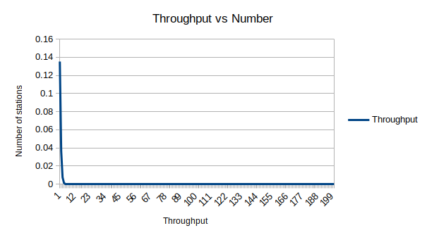
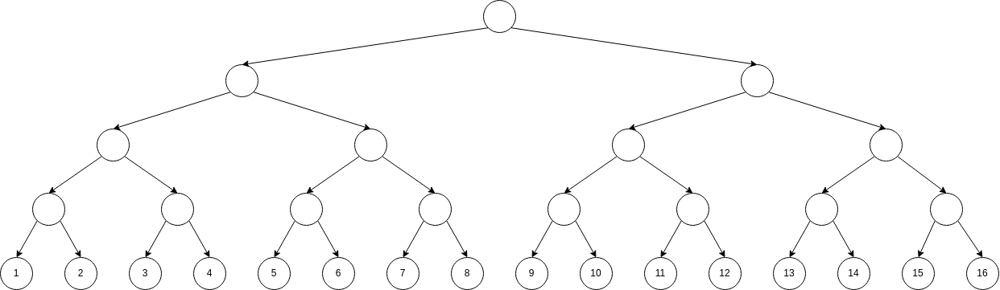
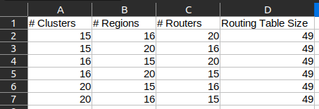

Calvin Passmore

A02107892

ECE 5600

# Homework 5

## Problem 4.2

A group of *N* stations share a 56-kpbs pure ALOHA channel. Each station outputs a 1000-bit frame on average once every 100 sec, even if the previous one has not yet been sent (e.g. the stations can buffer frames). What is the maximum value of *N*?

---

Because of the buffering, there will be no collisions and therefore no retransmissions.

  1000b / 100s = 10bps
  56000bps/10bps = 5,600 channels

---
---

## Problem 4.3

Consider the delay of pure ALOHA versus slotted ALOHA at a low load. Which one is less? Explain your answer.

---

Normally ALOHA is less efficient than slotted ALOHA because of collisions. However, at low loads, collisions are minimal/none, so slotted ALOHA has to wait for a slot before transmitting. Therefore at low loads, pure ALOHA is more efficient.

---
---

## Problem 4.4

A large population of ALOHA users manages to generate 50 requests/sec, including both originals and retransmissions. Time is slotted in units of 40 msec.

a. What is the chance of success on the first attempt?
b. What is the probability of exactly *k* collisions and then a success?
c. What is the expected number of transmission attempts needed?

---

a. 

Psuccess = e-G

50 transmissions in 1000 ms with 40 ms time slots

G = 2000/1000 = 2 requests/timeslot

P = e-2 = 0.135335283237

b. 

Pk = e-G(1-e-G)k

Pk = 0.135 * (0.865)k

c.

P = e-G * (1 - e-G)k - 1

sum from k=1 to infinity{ k Pk} = sum from k=1 to infinity{ k e-G * (1 - e-G)k - 1} = eG = e2 = 7.38 transmissions

---
---

## Problem 4.5

In an infinite-population-slotted ALOHA system, the mean number of slots a station waits between a collision and retransmission is 4. Plot the delay versus throughput curve for this system.

---

Throughput = G * e-2G

---
---

## Problem 4.6

What is the length of a contention slot in CSMA/CD for (a) a 2-km twin-lead cable (signal propagation speed is 82% of the signal propagation speed in a vacuum)?, and (b) a 40-km multimode fiber optic cable (signal propagation speed is 65% of the signal propagation speed in a vacuum)?

---

(a)

3e8 * 0.82 = 2.46e8 m/s

2000 \[m\] / 2.46e8 \[m/s\] = 0.00000813 s -> 8.13 us one way

contention slot = 16.26 us

(b) 

3e8 * 0.65 = 1.95e8 m/s

40,000 \[m\] / 1.95e8 \[m\s\] = 0.00020513 s -> 205.13 us on way

contention slot = 410.26 us

---
---

## Problem 4.7

How long does a station, *s*, have to wait in the worst case before it can start transmitting its frame over a LAN that uses the basic bit-map protocol?

---

N is the number of contention slots, and d is the length of the frame. So the station *s* will have to wait for all 8 contention slots to appear, and then N - 1 frames to be sent.

N + (N - 1) * d

---
---

## Problem 4.8

In the binary countdown protocol, explain how a lower-numbered station may be starved from sending a packet.

---

A binary countdown can starve a lower-numbered station by having high traffic in the high-numbered stations. Each time a high-numbered station wants to transmit, it gets priority over the lower-numbered stations.

---
---

## Problem 4.9

Sixteen stations, numbered 1 through 16, are contending for the use of a shared channel by using the adaptive tree walk protocol. If all the stations whose addresses are prime numbers suddenly become ready at once, how many bit slots are needed to resolve the contention?

---

Prime Numbers: 2, 3, 5, 7, 11, 13

1. 2, 3, 5, 7, 11, 13
2. 2, 3, 5, 7
3. 2, 3
4. 2
5. 3, 5, 7, 11, 13
6. 3, 5, 7
7. 3
8. 5, 7, 11, 13
9. 5, 7
10. 5
11. 7, 11, 13
12. 7
13. 11, 13
14. 11
15. 13

bit slots: 15

---
---

## Problem 4.10

Consider five wireless stations, *A*, *B*, *C*, *D*, and *E*. Station *A* can communicate with all other stations, *B* can communicate with *A*, *C*, and *E*. *C* can communicate with *A*, *B*, and *D*. *D* can communicate with *A*, *C*, and *E*. *E* can communicate with *A*, *D*, and *B*.

(a) When *A* is sending to *B*, what other communications are possible?
(b) When *B* is sending to *A*, what other communications are possible?
(c) When *B* is sending to *C*, what other communications are possible?

---

(a) Since all stations will see *A*'s communication, no other communications are possible
(b) Only D isn't receiving *B*'s communication, but all other stations can't receive without interfering with *B*->*A*, so no other communications are possible.
(c) Only D isn't receiving *B*'s communication, but all other stations can't receive without interfering with *B*->*A*, so no other communications are possible.

---
---

## Problem 4.11

Six stations, *A* through *F*, communicate using the MACA protocol. Is it possible for two transmissions to take place simultaneously? Explain your answer.

---

Yes, since all the stations are located in a line, *A* can talk to *B* while *C* talks to _D_, and _E_ talks to *F*.

---
---

## Problem 5.1

Give two example computer applications for which connection-oriented service is appropriate. Now give two examples of which connectionless service is best.

---

Connections oriented:
- MPLS
- VLANs

Connectionless:
- IP
- ARPANET

---
---

## Problem 5.2

Datagram networks route each packet as a separate unit, independent of all others. Virtual-circuit networks do not have to do this, since each data packet follows a predetermined route. Does this observation mean that virtual-circuit networks do not need the capability to route isolated packets from an arbitrary source to an arbitrary destination? Explain your answer.

---

No, virtual circuit networks do still need to route a packet from any source to any destination. For instance, TCP still needs to be able to send a packet from my computer to any other valid (possible) computer.

---
---

## Problem 5.6

Consider the network of Fig. 5-12(a). Distance vector routing is used, and the following vectors have just come in to router *C*: from *B*: (5, 0, 8, 12, 6, 2); from D: (16, 12, 6, 0, 9, 10); and from E: (7, 6, 3, 9, 0, 4). The cost of the links from *C* to *B*, *D*, and *E*, are 6, 3, and 5 respectively. what is *C*'s new routing table? Give both the outgoing line to use and the cost.

---

Starting C
A | B | D | E | F
--|---|---|---|--
  | 6 | 3 | 5 | 

Route through B:
A | B | D | E | F
--|---|---|---|--
11| 6 | 18| 12| 8

Route through D:
A | B | D | E | F
--|---|---|---|--
19| 18| 3 | 14| 13

Route through E:
A | B | D | E | F
--|---|---|---|--
12| 11| 14| 5 | 9

New routing table
A | B | D | E | F
--|---|---|---|--
11| 6 | 3 | 5 | 8

---
---

## Problem 5.9

For hierarchical routing with 4800 routers, what region and cluster sizes should be chosen to minimize the size of the routing table for a three-layer hierarchy? A good starting place is the hypothesis that a solution with _k_ clusters of *k* regions of *k* routers is close to optimal, which means that *k* is about the cube root of 4800 (around 16). Use trial and error to check out combinations where all three parameters are in the vicinity of 16.

---

The formula being used is

    (clusters- 1) + (regions - 1) + routers 

Below is a table of different parameters that each give a routing table size of 49.

---
---
