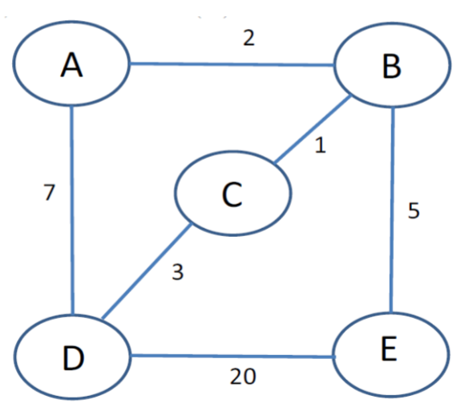
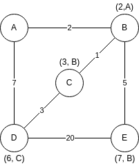

Calvin Passmore

A02107892

ECE 5600

# Homework 6

## Problem 6.17

A client sends a 128-byte request to a server located 100 km away over a 1-gigabit optical fiver. What is the efficiency of the line during the remote procedure call?

---

128 bytes = 1024 bits

This is about 1 us on a 1 Gbps network. The speed of light in optical fiber is 200km/ms. So a roundtrip signal would take 1 ms.

1k bits in 1 ms = 1M bits in 1s or 1Mbps. 1Mbps/1Gbps = 0.001 = 0.1% efficient.

---
---

## Problem 6.22

What is the total size of the minimum TCP MTU, including TCP and IP overhead but not including data link layer overhead?

---

The default byte payload is 536 bytes, TCP header is 20, IP header is 20

    536 + 20 + 20 = 576

---
---

## Problem 6.23

Datagram fragmentation and reassembly are handled by IP and are invisible to TCP. Does this mean that TCP does not have to worry about data arriving in the wrong order?

---

Even though IP sends the datagrams, it gives TCP the received fragments in whatever order they arrive. It is then up to TCP to re-order and assemble the fragments.

---
---

## Problem 6.31

Suppose that the TCP congestion window is set to 18 KB and a timeout occurs. How big will the window be if the next four transmission bursts are successful? Assume that the maximum segment size is 1 KB.

---

Timeout means resetting the window size to 1KB and doubling it every successful transmission. 1->success->2->success->4->success->8->success->16. However, the max is congestion window size/2. So the window size is set to 9KB.

---
---

## Problem 6.32

If the TCP round-trip time, *RTT*, is currently 30 msec and the following acknowledgments come in after, 32, and 24 msec, respectively, what is the new *RTT* estimate using the Jacobson algorithm? Use &#x0251; = 0.9.

---

RTT = &#x0251; RTT + (1 - &#x0251;) R

RTT = 0.9(30) + (1-0.9)(32) = 27+3.2 = 30.2

RTT = 0.9(30.2) + (0.1)(24) = 27.18 + 2.4 = 29.58

---
---

## Problem 6.33

A TCP machine is sending full windows of 65,535 bytes over a 1-Gbps channel that has a 10-msec one-way delay. What is the maximum throughput achievable? What is the line efficiency?

---

65535 bytes * 8 bits = 524280 bits

Max bps = 1Gpbs * 2 * 10 ms = 1 * 10^9 * 20 * 10^-3 = 20*10^6 b

65535 * 8 / 20*10^6 = 2.6% Efficiency

Throughput = Efficiency * bandwidth = 0.026 * 1Gbps = 26.214 Mbps

---
---

## Problem 8.4

Alice used a transposition cipher to encrypt her messages to Bob. For added security, she encrypted the transposition cipher key using a substitution cipher and kept the encrypted cipher in her computer. Trudy managed to get hold of the encrypted cipher key. Can Trudy decipher Alice's message to Bob? Why or why not?

---

Yes, Trudy can use the encrypted cipher key to decrypt the message to Bob, and then could brute force the transposition cipher, being almost a non-issue with modern computing.

---
---

## Problem 8.5

Find a 77-bit one-time pad that generates the text "Hello World" from the ciphertext of Fig 8-4.

---

Given cipher text:

    1001001 0100000 1101100 1101111 1110110 1100101 0100000 1111001 1101111 1110101 0101110

Shifting to character-length segments

    10010 01010000 01101100 11011111 11011011 00101010 00001111 00111011 11111010 10101110

One-Time Pad

    11011 01001001 00011010 10110011 00000100 00101111 01110010 11000111 01001100 11001010


```py

INPUT=0b10010010100000110110011011111110110110010101000001111001110111111101010101110

TARGET_STRING = "Hello World"

target_binary = int(''.join(format(ord(x), 'b') for x in TARGET_STRING), 2)

result_binary = INPUT ^ target_binary

print(bin(result_binary))


```

---
---

## Problem 8.17

Using the RSA public key cryptosystem, with *a*=1, *b*=2...*y*=25, *z*=26. 

(a) If *p*=5 and *q*=13, list five legal vales for *d*.

(b) If *p*=5, *q*=31, and *d*=37, find *e*.

(c) Using *p*=3,*q*=11, and *d*=9, find *e* and encrypt "hello".

---

(a) z =  (p - 1) x (q - 1) = (30) x (36) = 1080

Valid d values:

    1081
    1079
    10807
    653
    1021

(b) z = (4) x (30) = 120

e x d = 1 mod z

4 * 37 = 481 = 4*120 r 1

e = 4

(c) z = (2) x (10) = 20

e x 9 = 1 mod 20

e = 4

n = p x q = 33

C = P<sup>e</sup>(mod n)

```py
import math

MESSAGE = "hello"

e = 4
n = 33
k = math.floor(math.log2(n))
mask = (1 << k) - 1

bits = int(''.join(format(ord(x) - ord('a'), 'b') for x in MESSAGE), 2)

print(bin(bits))

num = math.floor((len(bin(bits)) / k) + 0.5)

print(num)

orig = []

for i in range(num):
    orig.insert(0, bits & mask)
    bits = bits >> k

encrypted = []

for seg in orig:
    encrypted.append(int(math.pow(seg,e) % n))

to_send = ''.join([f"{x:05b}" for x in encrypted])

print(to_send)

```

11001000111100101111

---
---

## Problem 8.18

Alice and Bob use RSA public key encryption in order to communicate between them. Trudy finds out that Alice and Bob shared one of the primes used to determine the number *n* of the public key pairs. In other words, Trudy found out that *n<sub>a</sub>* = *p<sub>a</sub>* x *q* and *n<sub>b</sub>* = *p<sub>b</sub>* x *q*. How can Trudy use this information to break Alice's code?

---

Using the given formaula, n = p x q, Trudy can determine the other prime and from there can derive z, then d and e, and will have all the whole cipher key.

---
---

## Problem: 
A network is shown below. Assume node A knows the 
distance to every other link; the numbers on each link (arc). Use 
Dijkstra’s algorithm to find the shortest path from Node A to all other 
nodes.



---



---
---